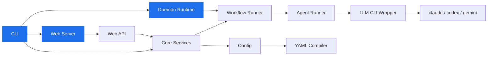

<div align="center">


<br/>

[](https://github.com/samishukri/animus)

<br/>
<br/>
<br/>


<a href="https://github.com/launchapp-dev/ao/releases/latest"></a>
&nbsp;

&nbsp;


</div>

<br/>

## Install

```bash
curl -fsSL https://raw.githubusercontent.com/samishukri/animus/main/install.sh | bash
```

The upstream installer currently targets macOS. On Linux and Windows, use a release archive or build from source.

<details>
<summary><kbd>options</kbd></summary>

```bash
# Specific version
ANIMUS_VERSION=v0.0.11 curl -fsSL https://raw.githubusercontent.com/samishukri/animus/main/install.sh | bash

# Custom directory
ANIMUS_INSTALL_DIR=/usr/local/bin curl -fsSL https://raw.githubusercontent.com/samishukri/animus/main/install.sh | bash
```

</details>

<details>
<summary><kbd>prerequisites</kbd></summary>

You need at least one AI coding CLI:

```bash
npm install -g @anthropic-ai/claude-code    # Claude (recommended)
npm install -g @openai/codex                # Codex
npm install -g @google/gemini-cli           # Gemini
```

</details>

---

## What is Animus?

Animus turns a single YAML file into an autonomous software delivery pipeline.

You define agents, wire them into phases, compose phases into workflows, schedule everything with cron — and Animus's daemon handles the rest: dispatching tasks to AI agents in isolated git worktrees, managing quality gates, and merging the results.

```
                ┌──────────────────────────────────────────────────┐
                │            Animus Daemon (Rust)                  │
                │                                                  │
  ┌────────┐    │    ┌───────────┐    ┌───────────┐    ┌────────┐ │    ┌────────┐
  │ Tasks  │───▶│───▶│  Dispatch │───▶│  Agents   │───▶│ Phases │─│──▶│  PRs   │
  │        │    │    │  Queue    │    │           │    │        │ │    │        │
  │ TASK-1 │    │    │ priority  │    │ Claude    │    │ impl   │ │    │ PR #42 │
  │ TASK-2 │    │    │ routing   │    │ Codex     │    │ review │ │    │ PR #43 │
  │ TASK-3 │    │    │ capacity  │    │ Gemini    │    │ test   │ │    │ PR #44 │
  └────────┘    │    └───────────┘    └───────────┘    └────────┘ │    └────────┘
                │                                                  │
                │    Schedules: work-planner (5m), pr-reviewer     │
                │    (5m), reconciler (5m), PO scans (2-8h)        │
                └──────────────────────────────────────────────────┘
```

---

## Quick Start

```bash
cd your-project                          # any git repo
animus doctor                            # check prerequisites
animus setup                             # initialize .ao/

animus task create --title "Add rate limiting" --task-type feature --priority high
animus workflow run --task-id TASK-001   # run once

animus daemon start --autonomous         # or go fully autonomous
```

---

## Everything in One YAML

<table>
<tr>
<td width="50%">

### Agents

Bind models, tools, MCP servers, and system prompts to named profiles. Route by task complexity.

```yaml
agents:
  default:
    model: claude-sonnet-4-6
    tool: claude
    mcp_servers: ["animus", "context7"]

  work-planner:
    system_prompt: |
      Scan tasks, check dependencies,
      enqueue ready work for the daemon.
    model: claude-sonnet-4-6
    tool: claude
```

</td>
<td width="50%">

### Phases

Reusable execution units. Three modes: **agent** (AI with decision contracts), **command** (shell), **manual** (human gate).

```yaml
phases:
  implementation:
    mode: agent
    agent: default
    directive: "Implement production code."
    decision_contract:
      min_confidence: 0.7
      max_risk: medium

  push-branch:
    mode: command
    command:
      program: git
      args: ["push", "-u", "origin", "HEAD"]
```

</td>
</tr>
<tr>
<td width="50%">

### Workflows

Compose phases into pipelines with skip conditions and post-success hooks.

```yaml
workflows:
  - id: standard
    phases:
      - requirements
      - implementation
      - push-branch
      - create-pr
    post_success:
      merge:
        strategy: squash
        auto_merge: true
        cleanup_worktree: true
```

</td>
<td width="50%">

### Schedules

Cron-based autonomous execution. The daemon runs your workflows on a cadence.

```yaml
schedules:
  - id: work-planner
    cron: "*/5 * * * *"
    workflow_ref: work-planner
    enabled: true

  - id: pr-reviewer
    cron: "*/5 * * * *"
    workflow_ref: pr-reviewer
    enabled: true
```

</td>
</tr>
</table>

---

## The Full Agent Team

Animus doesn't run one agent. It runs an **entire product organization**:

```
  ┌─────────────────────────────────────────────────────────────────┐
  │                                                                 │
  │   Planners               Builders              Reviewers        │
  │   ╭──────────────╮       ╭──────────────╮       ╭──────────────╮│
  │   │ Work Planner │       │ Claude Eng   │       │ PR Reviewer  ││
  │   │ Reconciler   │       │ Codex Eng    │       │ PO Reviewer  ││
  │   │ Triager      │       │ Gemini Eng   │       │ Code Review  ││
  │   │ Req Refiner  │       │ GLM Eng      │       │              ││
  │   ╰──────────────╯       ╰──────────────╯       ╰──────────────╯│
  │                                                                 │
  │   Product Owners         Architects             Operations      │
  │   ╭──────────────╮       ╭──────────────╮       ╭──────────────╮│
  │   │ PO: Web      │       │ Rust Arch    │       │ Sys Monitor  ││
  │   │ PO: MCP      │       │ Infra Arch   │       │ Release Mgr  ││
  │   │ PO: Workflow │       │              │       │ Branch Sync  ││
  │   │ PO: CLI      │       │              │       │ Doc Drift    ││
  │   │ PO: Runner   │       │              │       │ Wf Optimizer ││
  │   ╰──────────────╯       ╰──────────────╯       ╰──────────────╯│
  │                                                                 │
  └─────────────────────────────────────────────────────────────────┘
```

## Key Concepts

<table>
<tr>
<td width="33%">

**Decision Contracts**

Every agent phase returns a typed verdict: `advance`, `rework`, `skip`, or `fail`. Rework loops pass the reviewer's feedback back to the implementer. Configurable `max_rework_attempts` prevents infinite loops.

</td>
<td width="33%">

**Model Routing**

Route tasks to different models by type and complexity. Low-priority bugfixes go to cheap models. Critical architecture tasks go to Opus. The work-planner agent manages this automatically.

</td>
<td width="33%">

**Worktree Isolation**

Every task gets its own git worktree. Agents work in parallel on separate branches without conflicts. Post-success hooks handle merge, cleanup, and PR creation.

</td>
</tr>
</table>

| Complexity | Type | Model | Why |
|:---|:---|:---|:---|
| `low` | bugfix/chore | GLM-5-Turbo | Cheapest option |
| `medium` | feature | Claude Sonnet | Reliable, fast |
| `medium` | UI/UX | Gemini 3.1 Pro | Vision + design expertise |
| `high` | refactor | Codex GPT-5.3 | Strong code understanding |
| `high` | architecture | Claude Opus | Maximum quality |
| `critical` | any | Claude Opus | No compromises |

---

## Claude Code Integration

Install [**Animus Skills**](https://github.com/samishukri/animus-skills) for deep Animus integration inside Claude Code:

```bash
git clone https://github.com/samishukri/animus-skills.git ~/animus-skills
claude --plugin-dir ~/animus-skills
```

<table>
<tr>
<td width="50%">

**Slash Commands**

| Command | What it does |
|:---|:---|
| `/setup-animus` | Initialize Animus in your project |
| `/getting-started` | Install, concepts, first task |
| `/workflow-authoring` | Write custom YAML workflows |
| `/pack-authoring` | Build workflow packs |
| `/mcp-setup` | Connect AI tools via MCP |
| `/troubleshooting` | Debug common issues |

</td>
<td width="50%">

**Auto-Loaded References**

| Skill | Coverage |
|:---|:---|
| `configuration` | Config files, state layout, model routing |
| `task-management` | Full task lifecycle via CLI and MCP |
| `daemon-operations` | Daemon monitoring and troubleshooting |
| `workflow-patterns` | Patterns from 150+ autonomous PRs |
| `agent-personas` | PO, architect, auditor agents |
| `mcp-tools` | Complete `animus.*` tool reference |

</td>
</tr>
</table>

---

## CLI

```
animus task          Create, list, update, prioritize tasks
animus workflow      Run and manage multi-phase workflows
animus daemon        Start/stop the autonomous scheduler
animus queue         Inspect and manage the dispatch queue
animus agent         Control agent runner processes
animus output        Stream and inspect agent output
animus doctor        Health checks and auto-remediation
animus setup         Interactive project initialization
animus requirements  Manage product requirements
animus mcp           Start Animus as an MCP server
animus web           Launch the embedded web dashboard
animus status        Project overview at a glance
```

---

## Architecture

Animus is a Rust-only workspace with 17 crates. The major crates are:

- `orchestrator-cli` - CLI commands and dispatch
- `orchestrator-core` - services, state, and workflow lifecycle
- `orchestrator-config` - workflow YAML scaffolding, loading, and compilation
- `workflow-runner-v2` - workflow execution runtime
- `agent-runner` - LLM CLI process management
- `llm-cli-wrapper` - CLI tool abstraction layer
- `orchestrator-daemon-runtime` - daemon scheduler runtime
- `orchestrator-logging` - shared logging utilities
- `orchestrator-web-server` - embedded React dashboard
- `orchestrator-web-api` - web API business logic
- `orchestrator-providers` - provider integrations
- `orchestrator-store` - persistence primitives
- `protocol` - shared types and routing



---

## Platforms

| Platform | Architecture | |
|:---|:---|:---|
| macOS | Apple Silicon (M1+) | `aarch64-apple-darwin` |
| macOS | Intel | `x86_64-apple-darwin` |
| Linux | x86_64 | `x86_64-unknown-linux-gnu` |
| Windows | x86_64 | `x86_64-pc-windows-msvc` |

---

## License

This project is licensed under the [Elastic License 2.0 (ELv2)](LICENSE). You may use, modify, and distribute the software, but you may not provide it to third parties as a hosted or managed service.

---

<div align="center">

**Update**

```bash
curl -fsSL https://raw.githubusercontent.com/samishukri/animus/main/install.sh | bash
```

**Uninstall**

```bash
rm -f ~/.local/bin/animus \
  ~/.local/bin/agent-runner \
  ~/.local/bin/llm-cli-wrapper \
  ~/.local/bin/animus-oai-runner \
  ~/.local/bin/animus-workflow-runner
```

<br/>

<sub>Built with Rust. Powered by AI. Ships code autonomously.</sub>

</div>


