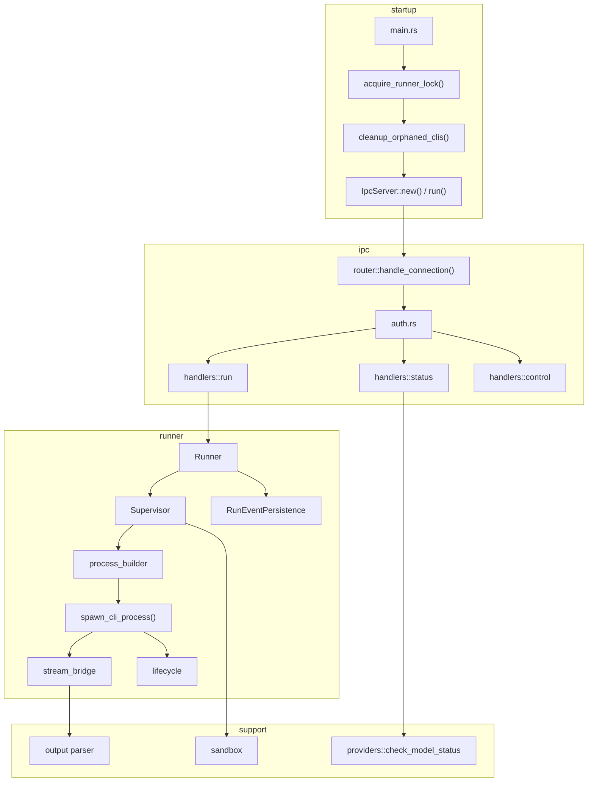
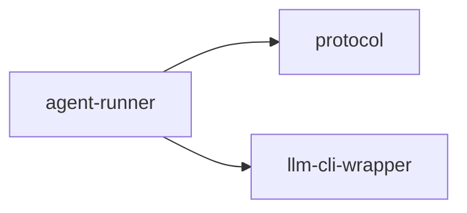

# agent-runner

Standalone daemon that spawns, supervises, and streams output from agent CLIs over an authenticated IPC channel.

## Overview

`agent-runner` is the process supervisor behind AO agent execution. It runs as a singleton process, accepts authenticated IPC requests from AO clients, launches the selected tool using a runtime contract, streams structured events back to the caller, and persists those events into scoped AO state.

The crate is a standalone binary, not a library target.

## Targets

- Binary: `agent-runner`

## Architecture

## Key Components

### Startup and locking

- `src/main.rs` initializes tracing, acquires the singleton lock, cleans up orphaned processes, and starts the IPC server.
- `src/lock.rs` uses file locking so only one runner instance is active for a given config scope.
- `src/cleanup.rs` tracks and removes orphaned CLI child processes from prior sessions.

### IPC layer

- `src/ipc/server.rs` binds the runner endpoint. On Unix this is a Unix domain socket in the AO global config directory; on non-Unix it falls back to TCP loopback.
- `src/ipc/auth.rs` requires an initial auth handshake using the configured runner token.
- `src/ipc/router.rs` routes `AgentRunRequest`, `ModelStatusRequest`, `AgentStatusRequest`, `RunnerStatusRequest`, and `AgentControlRequest`.
- `src/ipc/handlers/control.rs` currently implements `Terminate`; `Pause` and `Resume` are defined in the protocol but still return unsuccessful responses.

### Runner core

- `src/runner/mod.rs` keeps the live and finished run maps and coordinates cleanup.
- `src/runner/supervisor.rs` validates the workspace, sanitizes the environment, prepares launch settings, and maps process results into runner status.
- `src/runner/process_builder.rs` resolves launch invocations from runtime contracts via `llm-cli-wrapper`.
- `src/runner/process.rs` spawns the child process, enforces idle timeout behavior, wires MCP-related settings, and supports cancellation.
- `src/runner/stream_bridge.rs` forwards stdout and stderr lines into structured runner events.
- `src/runner/event_persistence.rs` writes event JSONL under scoped AO run directories.

### Output parsing and sandboxing

- `src/output/` extracts tool calls, artifacts, thinking blocks, and normal output from streamed CLI text.
- `src/sandbox/env_sanitizer.rs` applies an allowlist-based environment filter before spawn.
- `src/sandbox/workspace_guard.rs` ensures the requested working directory stays inside the project root or a managed AO worktree.

## Request flow

1. The client authenticates over IPC.
2. A run request is validated and dispatched into `Runner`.
3. `Supervisor` resolves the launch contract and process settings.
4. The child CLI is spawned and its output is streamed back as `AgentRunEvent` values.
5. Events are persisted to disk while the live stream is still active.
6. The final process result is mapped into terminal agent status and cleanup runs.

## Workspace dependencies

- `protocol`: IPC types, config helpers, model routing, process utilities, and shared constants.
- `llm-cli-wrapper`: launch-contract parsing, CLI capability helpers, PATH checks, and text normalization.

## Notes

- Event persistence uses repository-scoped AO directories, not ad hoc temp storage.
- Model availability checks are intentionally shallow: CLI presence plus required credential env vars.
