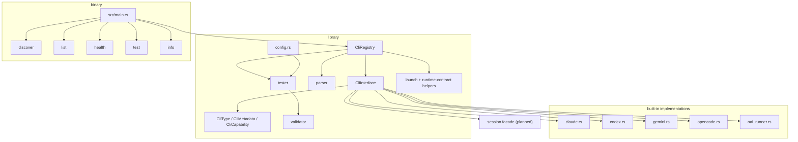
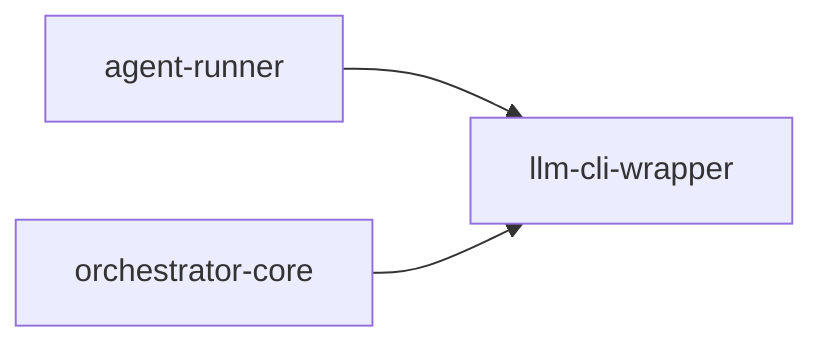

# llm-cli-wrapper

Library and companion CLI for discovering, validating, and normalizing the agent CLIs used by AO.

## Overview

`llm-cli-wrapper` provides the thin abstraction layer AO uses to reason about heterogeneous agent tools in one consistent way. It exposes CLI metadata, health checks, capability flags, test suites, launch-contract parsing, and output normalization, and it also ships a small binary for manual inspection and testing.

The next planned layer is a session-oriented backend facade for AO-owned native
CLI backends, informed by external reference libraries and protected by a
subprocess fallback path. See
[`docs/architecture/llm-cli-wrapper-session-backends.md`](../../docs/architecture/llm-cli-wrapper-session-backends.md).

## Targets

- Library: `cli_wrapper`
- Binary: `llm-cli-wrapper`

## Architecture

## Supported implementations

Built-in implementations that currently exist in `src/cli/`:

| CLI | Built-in implementation |
|---|---|
| Claude Code | Yes |
| OpenAI Codex | Yes |
| Google Gemini CLI | Yes |
| OpenCode | Yes |
| AO OAI Runner | Yes |

`CliType` also defines `Aider`, `Cursor`, `Cline`, and `Custom`. Those variants exist in the type system, but they do not currently have full built-in implementations in the registry.

## Binary commands

- `discover`
- `list`
- `health [cli]`
- `test [cli] --suite <basic|file-ops|code-gen>`
- `info <cli>`

## Key modules

- `src/cli/registry.rs`: discovery and registration of supported CLIs.
- `src/cli/types.rs`: capability flags, metadata, statuses, and supported CLI enum.
- `src/cli/launch.rs`: launch-contract parsing and machine-flag helpers.
- `src/parser/`: text extraction and normalized event parsing.
- `src/session/`: canonical session backend contract for native and fallback CLI sessions.
- `src/tester/`: health checks and reusable test suites.
- `src/validator/`: output validation helpers.
- `src/config.rs`: optional TOML-backed wrapper configuration.

## Integration points

- `agent-runner` uses it to parse runtime contracts and to normalize tool-specific launch behavior.
- `orchestrator-core` uses it when building runtime contracts and reasoning about tool capabilities.

## Notes

- The binary is a developer utility, not the main AO entrypoint.
- The library is the real production surface.
