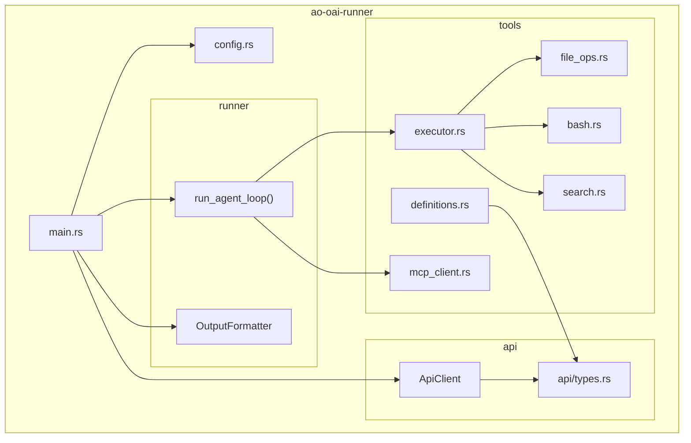
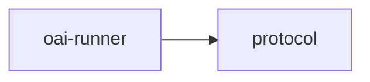

# oai-runner

Standalone OpenAI-compatible agent runner for AO, providing a multi-turn tool-using loop over OpenAI-style streaming APIs.

## Overview

`oai-runner` is a binary used when AO needs to talk to a provider through an OpenAI-compatible HTTP interface instead of a vendor-specific local CLI. It resolves provider configuration, streams chat completions, executes built-in and MCP tools locally, and emits either plain text or structured JSON events.

## Targets

- Binary: `ao-oai-runner`

## Architecture

## Command surface

The binary currently exposes a single `run` subcommand.

| Flag | Purpose |
|---|---|
| `--model` | Required model identifier |
| `--api-base` | Override inferred API base |
| `--api-key` | Override resolved API key |
| `--format json` | Emit JSON events instead of plain text |
| `--system-prompt` | Load system prompt from a file |
| `--working-dir` | Set tool execution directory |
| `--max-turns` | Bound the agent loop |
| `--idle-timeout` | HTTP timeout in seconds |
| `--response-schema` | Validate final answer against a JSON schema |
| `--read-only` | Restrict available tools |
| `--mcp-config` | Connect extra MCP servers |
| `--session-id` | Resume or persist conversation state |

## Key components

### Config resolution

`src/config.rs` resolves `api_base`, `api_key`, and normalized `model_id` using this precedence:

1. Explicit CLI flags
2. Provider inference from the model name
3. Environment variables
4. AO global credentials
5. OpenCode auth-file fallback

Current built-in provider inference includes MiniMax, Z AI / GLM, DeepSeek, and OpenRouter.

### Agent loop

`src/runner/agent_loop.rs` handles:

- session resume and persistence under `AO_CONFIG_DIR/sessions/` or `HOME/.ao/sessions/`
- streaming model responses
- local tool-call execution
- optional JSON-schema validation retries
- final output flush

### Built-in tools

The native tool set is:

- `read_file`
- `write_file`
- `edit_file`
- `list_files`
- `search_files`
- `execute_command`

`--read-only` restricts the set to `read_file`, `list_files`, and `search_files`.

## Workspace dependencies

`protocol` is used for shared credential loading and AO config-path conventions.

## Notes

- MCP tools are merged with the native tool list at runtime.
- The runner is intended to be supervised by AO, but it is also directly runnable for debugging.
