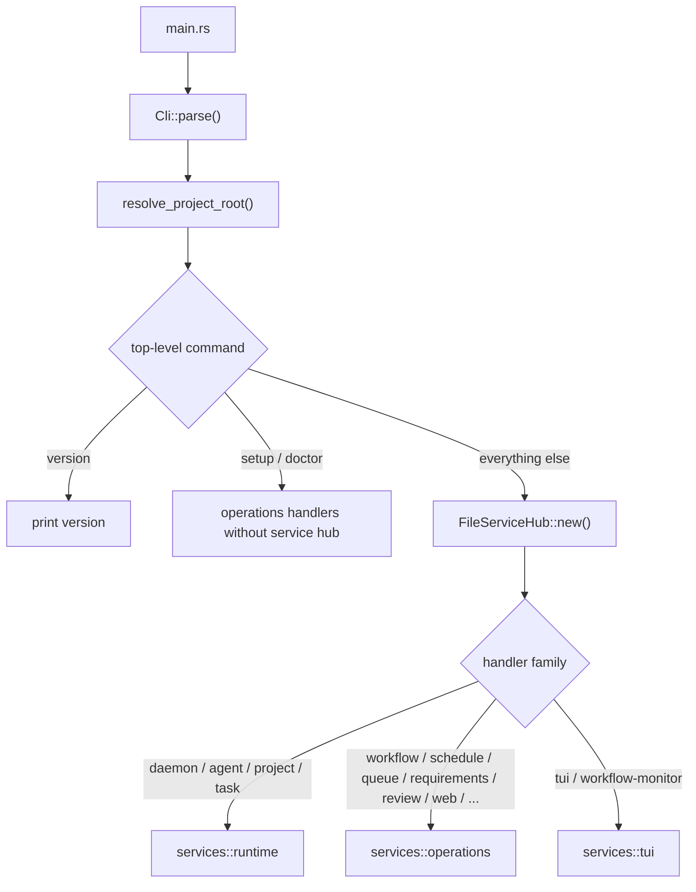
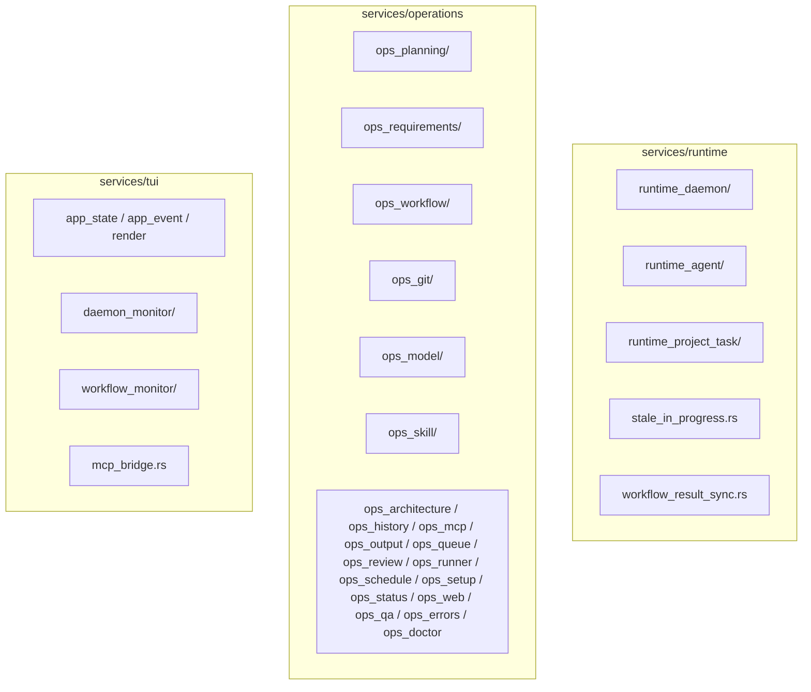
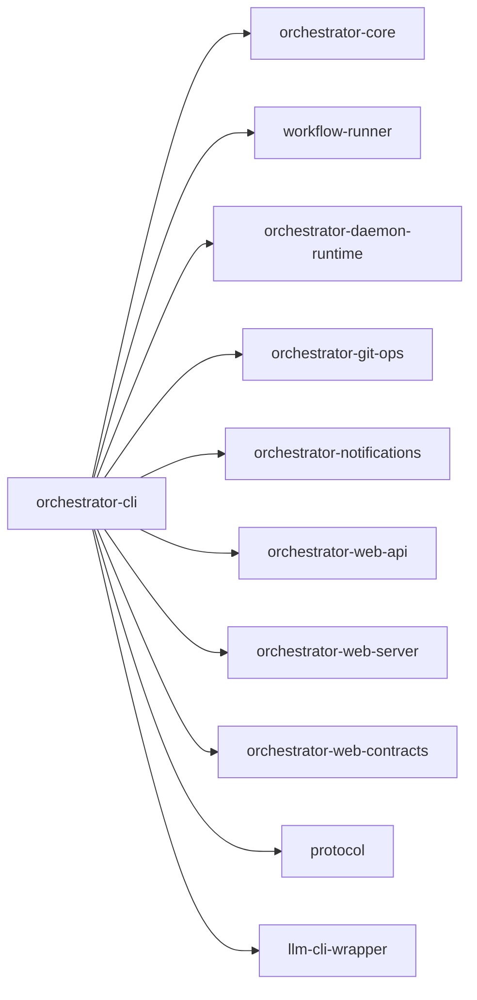

# orchestrator-cli

The main `ao` command-line binary and the primary user-facing surface of the AO workspace.

## Overview

Every `ao` invocation flows through this crate. It parses the command line, resolves the project root, decides whether a `FileServiceHub` is needed, and then dispatches the request into one of three handler families:

- `services::runtime`
- `services::operations`
- `services::tui`

It also owns the CLI-facing JSON envelope behavior for `--json`.

## Targets

- Binary: `ao`

## Architecture

## Current service tree

## Top-level command groups

Current top-level commands include:

- `version`
- `daemon`
- `agent`
- `project`
- `queue`
- `task`
- `workflow`
- `schedule`
- `vision`
- `requirements`
- `architecture`
- `review`
- `qa`
- `history`
- `errors`
- `git`
- `skill`
- `model`
- `runner`
- `status`
- `output`
- `mcp`
- `web`
- `setup`
- `tui`
- `doctor`

## Key pieces

### CLI types

`src/cli_types/` contains the Clap-derived command tree. The command surface is split by domain into files such as `task_types.rs`, `workflow_types.rs`, `daemon_types.rs`, `agent_types.rs`, `review_types.rs`, and `web_types.rs`.

### Shared CLI infrastructure

- `src/shared/output.rs`: JSON envelope formatting and success/error printing.
- `src/shared/cli_error.rs`: CLI error classification and exit-code mapping.
- `src/shared/parsing.rs`: argument normalization and validation helpers.
- `src/shared/runner.rs`: runner-related helper logic used by the command handlers.

### Runtime handlers

The runtime layer handles stateful or long-lived flows such as daemon lifecycle, agent execution, and task/project mutations.

### Operations handlers

The operations layer handles planning, CRUD, inspection, web serving, queue management, review, model inspection, git commands, schedules, and similar command groups.

### TUI handlers

The TUI layer provides the `tui` and `workflow-monitor` experiences built on `ratatui` and `crossterm`.

## Workspace dependencies

## Notes

- `setup` and `doctor` are handled before `FileServiceHub` initialization.
- All `--json` responses use the `ao.cli.v1` schema envelope.
