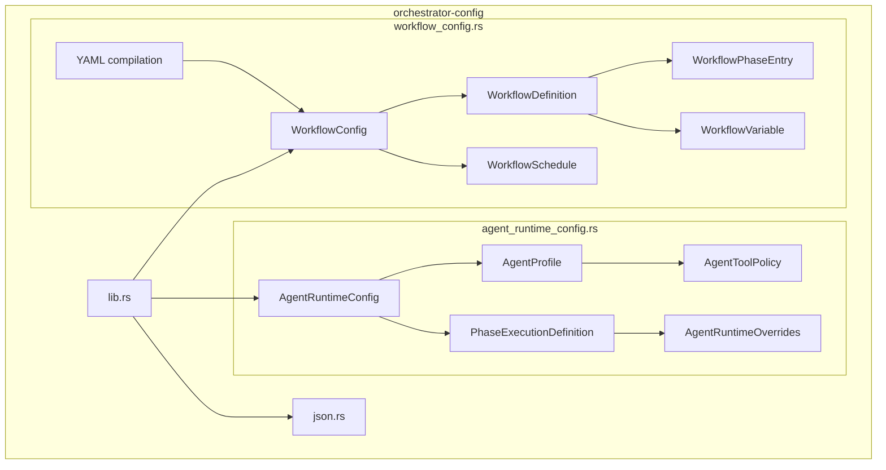
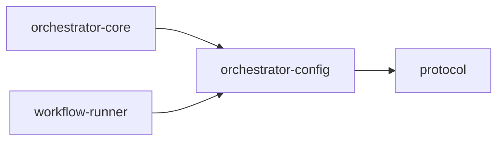

# orchestrator-config

Centralized configuration loading, validation, and compilation for AO runtime and workflow config.

## Overview

`orchestrator-config` is the schema and file-management crate for AO configuration. It owns two core config domains:

- `agent-runtime-config.v2.json`
- `workflow-config.v2.json`

It also supports YAML workflow authoring under `.ao/workflows.yaml` and `.ao/workflows/`, compiling those sources into the current JSON workflow config format when needed.

## Targets

- Library: `orchestrator_config`

## Architecture

## Key components

### Agent runtime config

`src/agent_runtime_config.rs` defines:

- agent profiles
- phase execution definitions
- tool/model overrides
- MCP server bindings
- retry and backoff configuration
- output and decision contracts

It also provides the load, ensure, hash, and write helpers for the v2 runtime config file.

### Workflow config

`src/workflow_config.rs` defines:

- workflow definitions and phase catalogs
- verdict routing and skip guards
- workflow variables
- post-success merge config
- integrations and daemon config
- workflow schedules
- YAML compilation and validation helpers

### JSON persistence

`src/json.rs` provides the pretty JSON writer used by the config load/write helpers.

## File conventions

- JSON workflow config lives under the scoped AO state root in `state/workflow-config.v2.json`.
- YAML workflow sources are loaded from `.ao/workflows.yaml` and `.ao/workflows/*.yaml`.
- Agent runtime config lives under the scoped AO state root in `state/agent-runtime-config.v2.json`.

## Workspace dependencies

## Notes

- This crate validates and compiles config. It does not execute workflows or agents itself.
- `orchestrator-core` and `workflow-runner` are its primary downstream consumers.
