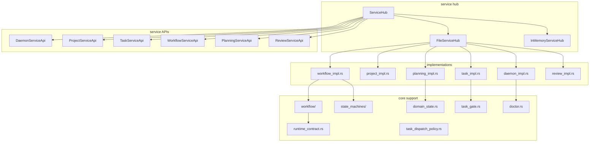
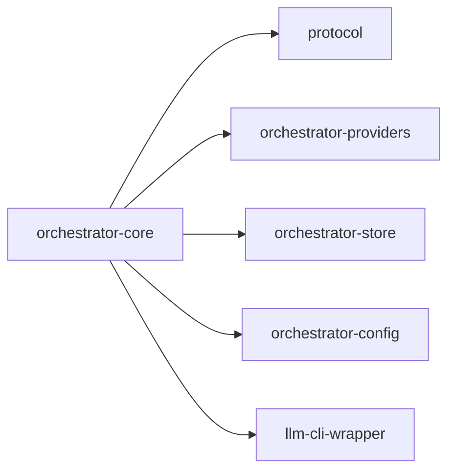

# orchestrator-core

Central domain logic, service abstractions, and state management for AO.

## Overview

`orchestrator-core` is the service-layer foundation of the workspace. It owns the `ServiceHub` abstraction, the production `FileServiceHub`, the test-oriented `InMemoryServiceHub`, and the bulk of AO business logic around tasks, workflows, requirements, projects, reviews, runtime contracts, and state-machine handling.

## Targets

- Library: `orchestrator_core`

## Architecture

## Key components

### Service hub layer

- `ServiceHub` is the dependency-injection boundary used across CLI and web layers.
- `FileServiceHub` is the production implementation backed by AO JSON state on disk.
- `InMemoryServiceHub` supports tests and isolated runtime flows.

### Service APIs

The crate exposes service interfaces for:

- daemon control
- project CRUD
- task lifecycle management
- workflow execution and inspection
- planning and requirements
- review and handoff flows

### Workflow and state support

- `src/workflow/` handles workflow lifecycle, resume logic, checkpointing, and state management.
- `src/state_machines/` loads and validates the workflow and requirement state-machine documents.
- `src/runtime_contract.rs` builds CLI launch contracts and capability mappings.
- `src/domain_state.rs` manages reviews, QA results, approvals, errors, history, and handoffs.

### Policy and diagnostics

- `src/task_gate.rs` enforces dependency and merge gates.
- `src/task_dispatch_policy.rs` drives routing decisions for daemon dispatch.
- `src/model_quality.rs` tracks phase outcomes by model.
- `src/doctor.rs` produces diagnostic reports and remediation suggestions.

## Workspace dependencies

## Notes

- `FileServiceHub` is the main AO state bootstrap point for repository-backed use.
- Feature flags `jira`, `linear`, and `gitlab` are forwarded into provider integrations.
