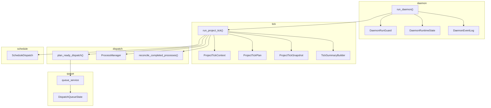
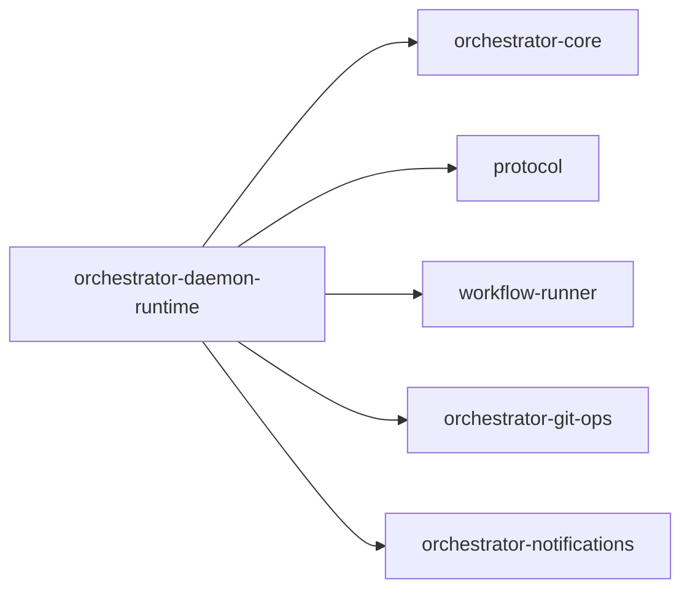

# orchestrator-daemon-runtime

Core runtime engine for the AO daemon tick loop, queue, scheduling, and process reconciliation.

## Overview

`orchestrator-daemon-runtime` provides the continuous runtime machinery behind `ao daemon ...`. It owns the daemon lifecycle loop, the dispatch queue, schedule evaluation, ready-dispatch planning, spawned workflow-runner process tracking, and reconciliation of completed work back into AO state.

## Targets

- Library: `orchestrator_daemon_runtime`

## Architecture

## Key components

### Daemon lifecycle

- `src/daemon/run_daemon.rs` is the top-level loop.
- `src/daemon/daemon_run_guard.rs` ensures only one daemon instance runs per project scope.
- `src/daemon/daemon_runtime_state.rs` tracks pause and shutdown state.
- `src/daemon/daemon_event_log.rs` appends structured daemon events.

### Tick execution

- `src/tick/` computes per-tick context, captures snapshots, performs schedule processing, dispatches ready work, reconciles finished processes, and builds summaries.
- `ProjectTickExecutionOutcome` and `ProjectTickSummary` capture what happened during the tick.

### Dispatch and process management

- `src/dispatch/process_manager.rs` manages spawned workflow-runner processes.
- `build_runner_command_from_dispatch()` assembles the child-process invocation for task, requirement, or custom subjects.
- `plan_ready_dispatch()` merges queue-backed and fallback-ready work into the final start plan.
- `reconcile_completed_processes()` projects completed process results back into AO state.

### Queue and scheduling

- `src/queue/` persists and mutates the dispatch queue.
- `src/schedule/schedule_dispatch.rs` evaluates configured workflow schedules and gates them on active hours.

## Workspace dependencies

## Notes

- This crate is library-only. The CLI crate owns the actual command-line surface.
- Queue state, daemon runtime state, and event logs are all persisted as AO-managed files.
