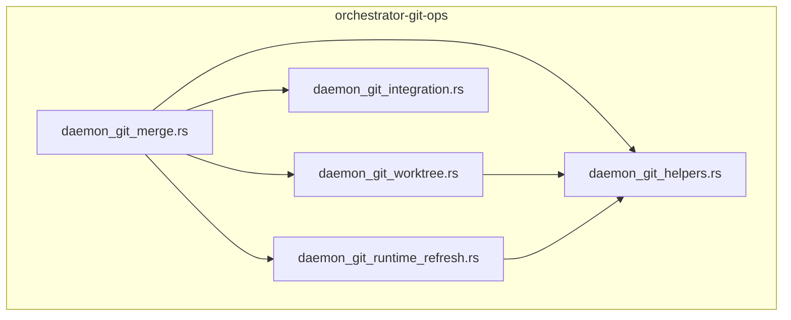
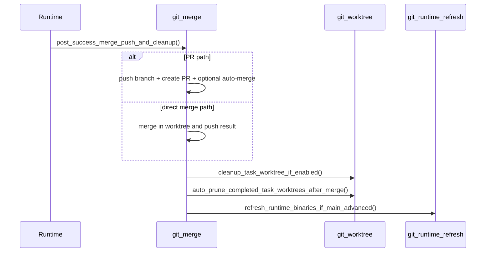
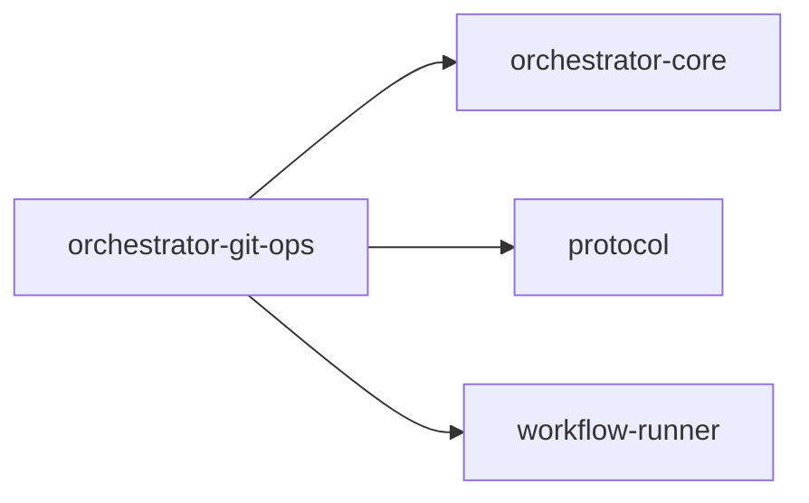

# orchestrator-git-ops

Safe, reusable Git operations for AO daemon and workflow flows.

## Overview

`orchestrator-git-ops` consolidates Git-facing behavior that would otherwise be scattered across runtime crates. It handles worktree naming and cleanup, post-success merge and PR flows, git-integration retries, and runtime binary refresh when `main` advances.

## Targets

- Library: `orchestrator_git_ops`

## Architecture

## Key components

### Helpers

`daemon_git_helpers.rs` contains:

- post-success git config loading
- branch and worktree naming conventions
- repo AO root and worktree root resolution
- git command wrappers
- merge ancestry and branch-merged checks

### Worktree management

`daemon_git_worktree.rs` handles:

- parsing `git worktree list --porcelain`
- identifying task worktrees
- rebasing worktrees on main
- pruning completed-task worktrees
- cleanup of individual task worktrees

### Merge and PR flow

`daemon_git_merge.rs` owns:

- direct merge flow
- branch push helpers
- `gh`-based PR creation
- auto-merge enablement
- merge-conflict finalization
- post-success cleanup hooks

### Integration outbox and runtime refresh

- `daemon_git_integration.rs` persists retryable git operations into an outbox.
- `daemon_git_runtime_refresh.rs` tracks main-head advancement and can rebuild AO runtime binaries.

## Post-success flow

## Workspace dependencies

## Notes

- The crate shells out to `git`, `gh`, and in some refresh paths `cargo`.
- It is shared infrastructure, not the owner of workflow policy.
