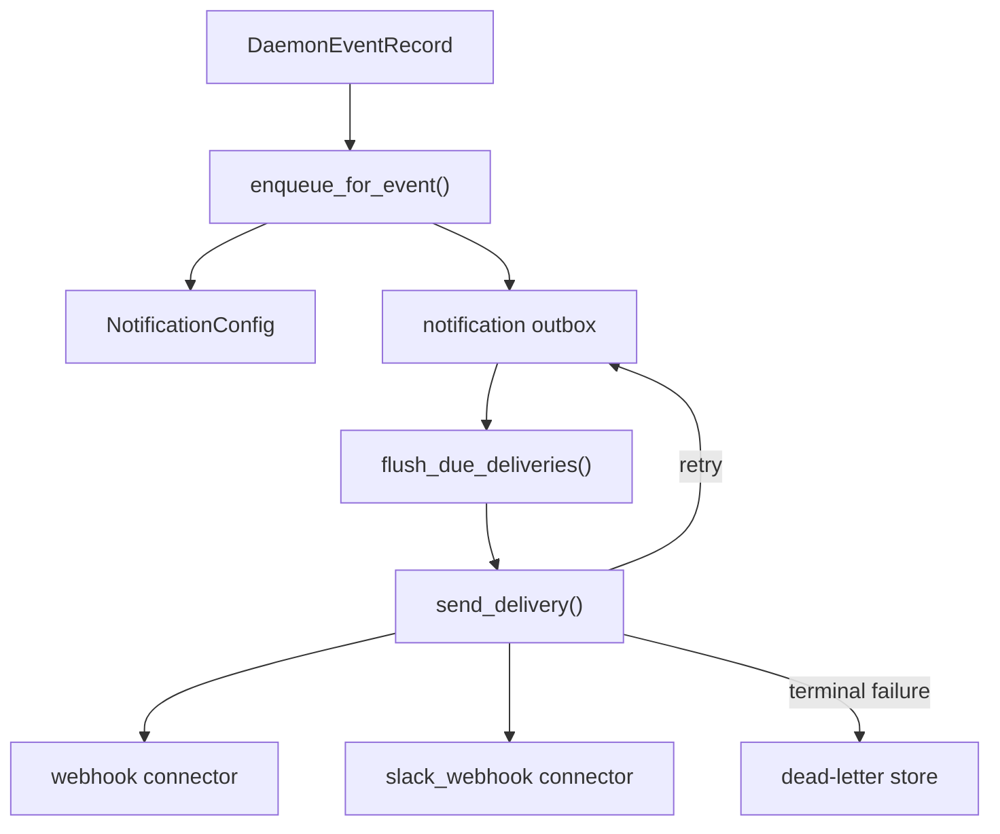
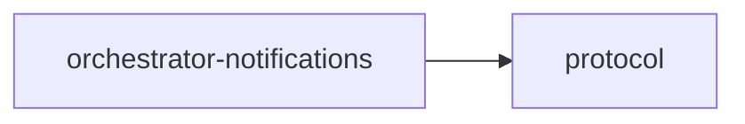

# orchestrator-notifications

Notification delivery subsystem for AO daemon events.

## Overview

`orchestrator-notifications` implements AO's persistent, retry-aware notification pipeline. It evaluates daemon events against configured subscriptions, enqueues matching deliveries into an outbox, retries transient failures with backoff, and moves exhausted deliveries into a dead-letter store.

Secrets are resolved from environment variables at delivery time rather than being written to AO state files.

## Targets

- Library: `orchestrator_notifications`

## Architecture

## Key components

- `DaemonNotificationRuntime`: main runtime entry point.
- `NotificationConfig`: top-level config with connectors, subscriptions, retry policy, and flush budget.
- Connector types: `webhook` and `slack_webhook`.
- Config helpers: parse, serialize, read, and clear notification config values.

## Runtime flow

1. `enqueue_for_event()` reloads config and matches subscriptions.
2. Matching deliveries are written into the outbox with idempotent delivery keys.
3. `flush_due_deliveries()` sends a bounded number of ready deliveries.
4. Failures are classified as transient, permanent, or misconfigured.
5. Retries stay in the outbox; exhausted deliveries move to the dead-letter store.

## Workspace dependencies

## Notes

- Input events are `protocol::DaemonEventRecord` values.
- The crate is designed to be called from the daemon tick loop, not to run its own scheduler.
