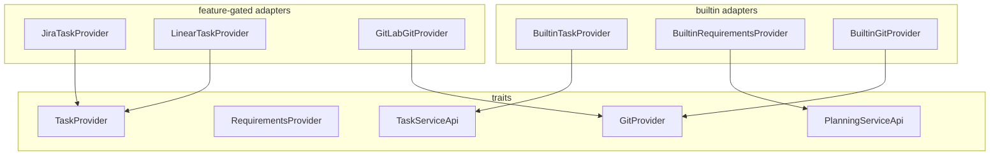

# orchestrator-providers

Provider abstraction crate for tasks, requirements, and git hosts.

## Overview

`orchestrator-providers` defines the provider traits that AO's service layer depends on and ships the builtin adapters that bridge those traits to the local AO state model. It also contains optional external integrations behind feature flags.

## Targets

- Library: `orchestrator_providers`

## Architecture

## Core traits and adapters

- `TaskProvider`
- `RequirementsProvider`
- `TaskServiceApi`
- `PlanningServiceApi`
- `GitProvider`

Built-in adapters:

- `BuiltinTaskProvider`
- `BuiltinRequirementsProvider`
- `BuiltinGitProvider`

Other exported implementations:

- `GitHubProvider`
- `JiraTaskProvider` when `jira` is enabled
- `LinearTaskProvider` when `linear` is enabled
- `GitLabGitProvider` when `gitlab` is enabled

## Feature flags

- `jira`
- `linear`
- `gitlab`

## Notes

- `GitHubProvider` exists but is still placeholder-only; the builtin git provider is the concrete implementation used today.
- `orchestrator-core` depends on this crate for provider-facing abstractions.
