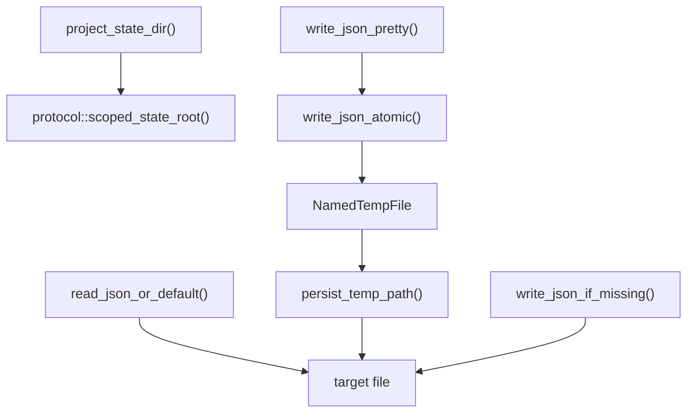

# orchestrator-store

Atomic, file-backed JSON persistence helpers for AO state.

## Overview

`orchestrator-store` is the low-level persistence crate used to safely read and write AO JSON state. It resolves the scoped state directory, supports default-on-missing reads, and uses temp-file-plus-rename writes to reduce corruption risk.

## Targets

- Library: `orchestrator_store`

## Architecture

## Public API

- `project_state_dir`
- `read_json_or_default`
- `write_json_atomic`
- `write_json_pretty`
- `write_json_if_missing`

## Notes

- This crate has no AO domain logic.
- Higher-level crates build task, workflow, review, and queue persistence on top of it.
