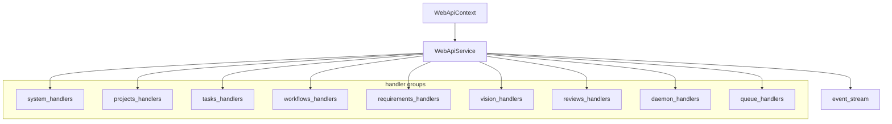
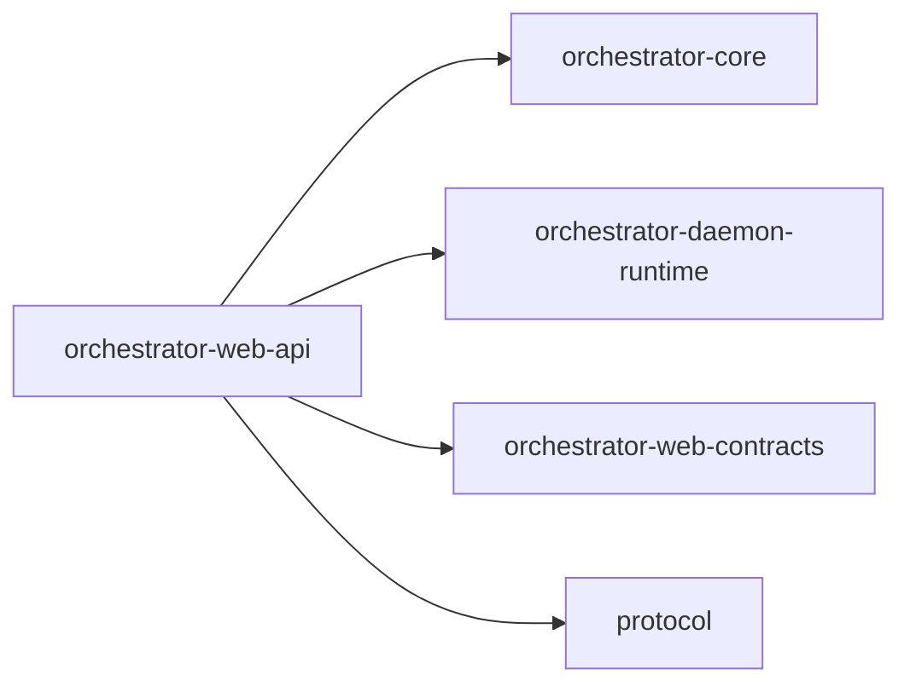

# orchestrator-web-api

Transport-agnostic web API business layer for AO.

## Overview

`orchestrator-web-api` sits between the Axum server crate and the AO service hub. It normalizes request inputs, delegates to core and daemon-runtime services, and publishes sequenced daemon-style events for SSE consumers.

## Targets

- Library: `orchestrator_web_api`

## Architecture

## Key types

- `WebApiContext`
- `WebApiService`
- `WebApiError`

## Responsibilities

- delegate task, workflow, project, planning, daemon, and queue operations
- parse and normalize web-facing inputs
- broadcast daemon-style events through an in-process channel
- replay persisted events for reconnecting clients

## Workspace dependencies

## Notes

- This crate does not define HTTP routes or bind a socket.
- `orchestrator-web-server` is the transport layer on top of it.
