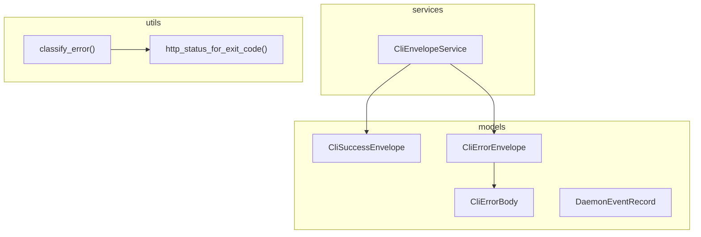

# orchestrator-web-contracts

Shared request/response contracts and error-handling utilities for AO's web layer.

## Overview

`orchestrator-web-contracts` keeps the web-facing envelope and error-mapping logic in one small crate so the API service layer and the Axum transport layer both produce the same `ao.cli.v1` schema.

## Targets

- Library: `orchestrator_web_contracts`

## Architecture

## Public surface

- `CliSuccessEnvelope<T>`
- `CliErrorEnvelope`
- `CliErrorBody`
- `DaemonEventRecord` re-export
- `CliEnvelopeService`
- `classify_error`
- `http_status_for_exit_code`

## Notes

- The crate is intentionally small and dependency-light.
- It is shared by both `orchestrator-web-api` and `orchestrator-web-server`.
