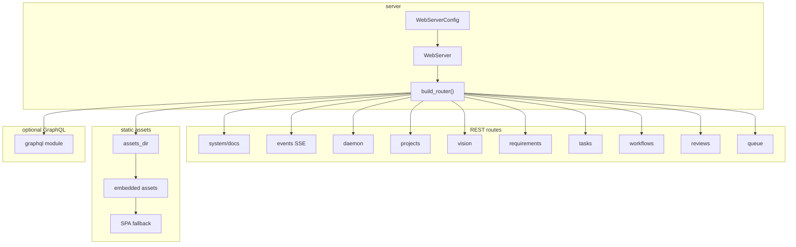
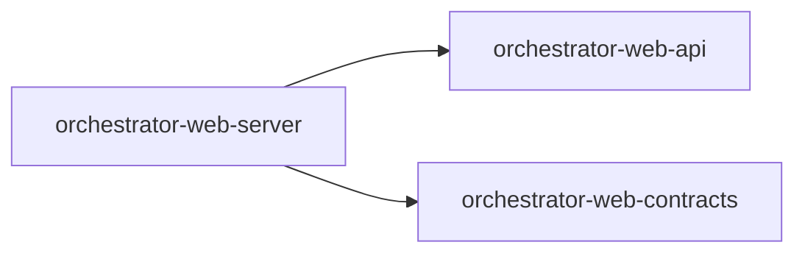

# orchestrator-web-server

Axum-based HTTP server for AO, with REST endpoints, SSE, embedded assets, and optional GraphQL support.

## Overview

`orchestrator-web-server` is the transport layer for AO's web interface. It binds the HTTP listener, mounts the REST API under `/api/v1`, serves static assets, exposes an SSE event stream, renders OpenAPI docs, and optionally compiles GraphQL handlers.

All business logic is delegated to `orchestrator-web-api`.

## Targets

- Library: `orchestrator_web_server`

## Architecture

## Public API

- `WebServer`
- `WebServerConfig`

`WebServerConfig` currently includes:

- `host`
- `port`
- `assets_dir`
- `api_only`
- `default_page_size`
- `max_page_size`

## Route groups

Current REST groups under `/api/v1`:

- `system`
- `events`
- `daemon`
- `projects`
- `vision`
- `requirements`
- `tasks`
- `workflows`
- `reviews`
- `queue`

## Feature flags

- `graphql`: enables the GraphQL schema and handlers in `src/services/graphql/`

## Workspace dependencies

## Notes

- Static asset resolution prefers `assets_dir`, then embedded assets, then SPA fallback.
- The default bind address is `127.0.0.1:4173`.
