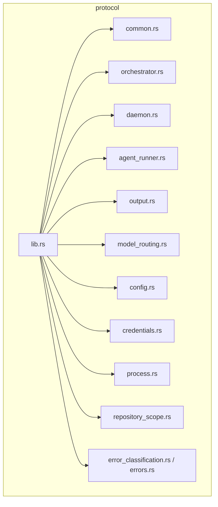
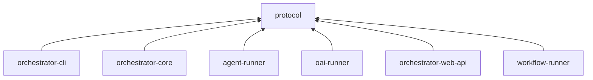

# protocol

Shared wire protocol types and contracts used across the AO workspace.

## Overview

`protocol` is the foundational type crate for AO. It defines the serializable types, IDs, config helpers, process helpers, model-routing logic, and shared constants that cross crate boundaries.

Serde field names and enum tags defined here should be treated as compatibility-sensitive.

## Targets

- Library: `protocol`

## Architecture

## Major modules

- `common`: IDs, timestamps, and shared enums
- `orchestrator`: tasks, requirements, workflows, projects, and related domain types
- `daemon`: daemon event and status types
- `agent_runner`: IPC request/response/event types
- `output`: structured agent output records
- `model_routing`: model normalization and tool-selection helpers
- `config` and `credentials`: config paths, MCP config, and credential resolution
- `process` and `repository_scope`: process helpers and repository-scoped AO paths
- `error_classification` and `errors`: protocol error mapping

## Constants

- `PROTOCOL_VERSION = "1.0.0"`
- `CLI_SCHEMA_ID = "ao.cli.v1"`
- `MAX_UNIX_SOCKET_PATH_LEN = 100`

## Workspace role

## Notes

- This crate sits near the bottom of the workspace dependency graph.
- It is the single source of truth for AO wire-level compatibility.
