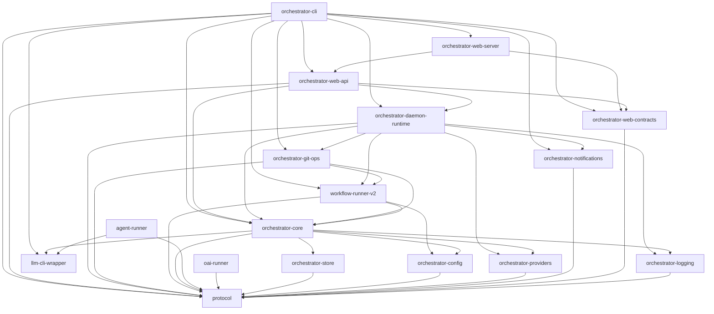

# Architecture Overview

AO is a Rust-only agent orchestrator CLI built as a 17-crate Cargo workspace. It provides a CLI, daemon runtime, workflow runner, agent runner, MCP server, and web UI for orchestrating AI workflows.

## Crate Dependency Graph

`protocol` sits at the foundation for shared types, configuration shapes, and runtime path derivation.

`orchestrator-core` provides the domain services and state mutation APIs used by the CLI, web layer, and daemon.

`orchestrator-cli` composes the workspace into the user-facing `ao` command surface.

## Architecture Decision Records

- [Plugin Pack Kernel](plugin-pack-kernel.md) -- Package-style plugin architecture for workflows, MCP servers, and bundled domain modules
- [Subject Dispatch Daemon](subject-dispatch-daemon.md) -- How the daemon schedules and dispatches workflow subjects
- [Tool-Driven Mutation Surfaces](tool-driven-mutation-surfaces.md) -- How state mutations are channeled through tool abstractions
- [Workflow-First CLI](workflow-first-cli.md) -- Why workflows are the primary execution primitive
- [Phase Contracts](phase-contracts.md) -- Universal phase verdicts, YAML-defined fields, and runtime validation

## Deep Dives

- [Crate Map](crate-map.md) -- All 17 crates grouped by responsibility with descriptions
- [ServiceHub Pattern](service-hub.md) -- Dependency injection via the `ServiceHub` trait
- [llm-cli-wrapper Session Backends](llm-cli-wrapper-session-backends.md) -- Planned unified session facade for SDK-backed CLI integrations
