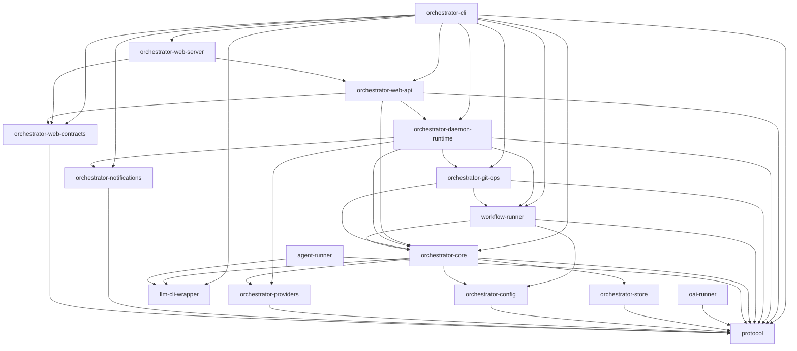

# Architecture Overview

AO is a Rust-only agent orchestrator CLI built as a 16-crate Cargo workspace. It provides a CLI, daemon, agent runner, LLM wrappers, MCP server, and web UI for orchestrating AI agent workflows.

## Crate Dependency Graph

**protocol** sits at the foundation -- every crate depends on it for shared wire types, configuration, and IPC contracts.

**orchestrator-core** occupies the middle layer, providing domain logic, state management, and the ServiceHub dependency injection pattern.

**orchestrator-cli** sits at the top as the main `ao` binary, composing all other crates into the user-facing command surface.

## Architecture Decision Records

- [Subject Dispatch Daemon](subject-dispatch-daemon.md) -- How the daemon schedules and dispatches workflow subjects
- [Tool-Driven Mutation Surfaces](tool-driven-mutation-surfaces.md) -- How state mutations are channeled through tool abstractions
- [Workflow-First CLI](workflow-first-cli.md) -- Why workflows are the primary execution primitive
- [Phase Contracts](phase-contracts.md) -- Universal phase verdicts, YAML-defined fields, and runtime validation

## Deep Dives

- [Crate Map](crate-map.md) -- All 16 crates grouped by responsibility with descriptions
- [ServiceHub Pattern](service-hub.md) -- Dependency injection via the ServiceHub trait
- [llm-cli-wrapper Session Backends](llm-cli-wrapper-session-backends.md) -- Planned unified session facade for SDK-backed CLI integrations
