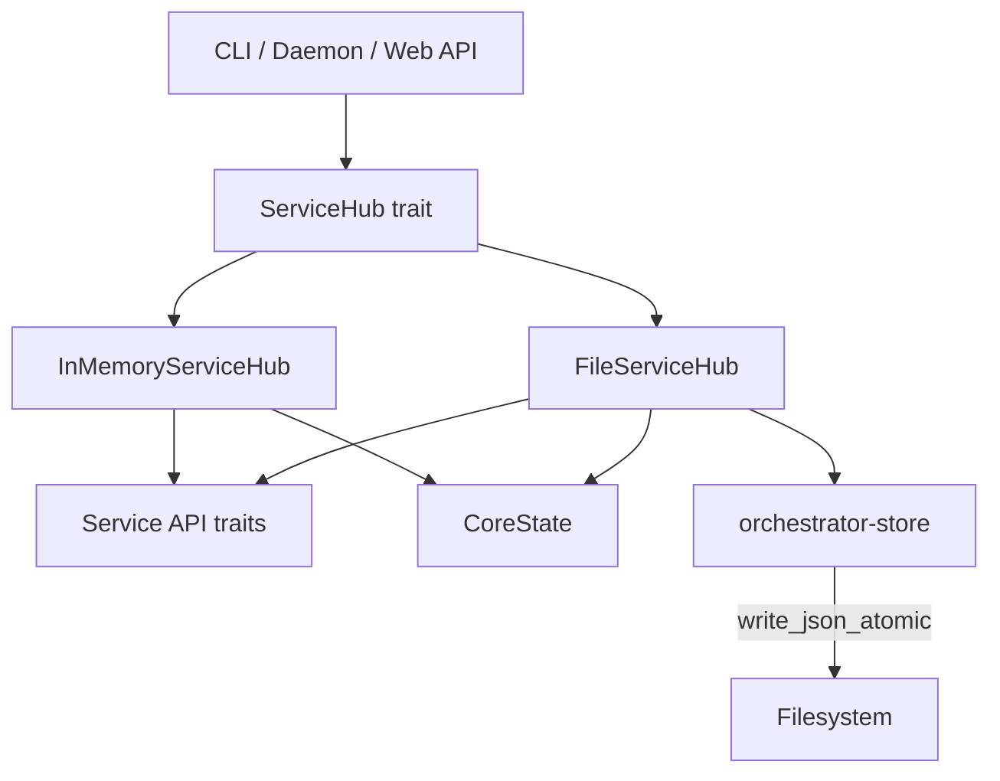

# ServiceHub Pattern

The `ServiceHub` trait is AO's dependency injection mechanism. It provides a uniform interface for accessing all domain service APIs, allowing production code and tests to share the same business logic with different backing implementations.

## The ServiceHub Trait

Defined in `crates/orchestrator-core/src/services.rs`:

```rust
pub trait ServiceHub: Send + Sync {
    fn daemon(&self) -> Arc<dyn DaemonServiceApi>;
    fn projects(&self) -> Arc<dyn ProjectServiceApi>;
    fn tasks(&self) -> Arc<dyn TaskServiceApi>;
    fn task_provider(&self) -> Arc<dyn TaskProvider>;
    fn subject_resolver(&self) -> Arc<dyn SubjectResolver>;
    fn workflows(&self) -> Arc<dyn WorkflowServiceApi>;
    fn planning(&self) -> Arc<dyn PlanningServiceApi>;
    fn requirements_provider(&self) -> Arc<dyn RequirementsProvider>;
    fn project_adapter(&self) -> Arc<dyn ProjectAdapter>;
    fn review(&self) -> Arc<dyn ReviewServiceApi>;
}
```

Each accessor returns an `Arc<dyn Trait>`, enabling shared ownership and dynamic dispatch across async boundaries.

## Service API Traits

Each domain area is defined as an async trait:

| Trait | Responsibility |
|-------|---------------|
| `DaemonServiceApi` | Start, stop, pause, resume, health, logs |
| `ProjectServiceApi` | List, get, create, upsert, archive, remove projects |
| `TaskServiceApi` | CRUD, status transitions, assignment, checklist, dependencies |
| `WorkflowServiceApi` | Run, resume, pause, cancel, phase completion, merge conflict handling |
| `PlanningServiceApi` | Vision drafting, requirements CRUD, execution |
| `ReviewServiceApi` | Agent handoff requests |

Provider traits (`TaskProvider`, `RequirementsProvider`, `SubjectResolver`, `ProjectAdapter`, `GitProvider`) abstract external data sources so integrations (Jira, Linear, GitLab) can be swapped in via feature flags.

## FileServiceHub (Production)

`FileServiceHub` is the production implementation. It persists all state as JSON files under the scoped project directory.

```
~/.ao/<repo-scope>/
  state/
    core-state.json
    workflow-config.compiled.json
    agent-runtime-config.v2.json
    state-machines.v1.json
    ...
  workflows/
    <workflow-id>.json
    ...
```

Construction happens at CLI startup:

1. Resolve the project root from the current working directory (or `--project-root` flag)
2. Bootstrap base configs (workflow config, agent runtime config) if missing
3. Load `core-state.json` into an `Arc<RwLock<CoreState>>` for concurrent access
4. Load workflow state from individual workflow JSON files
5. Return the hub, ready for service API calls

File locking (`fs2::FileExt`) protects concurrent access when multiple CLI invocations or daemon ticks operate on the same project state.

## InMemoryServiceHub (Tests)

`InMemoryServiceHub` holds all state in an `Arc<RwLock<CoreState>>` with no file I/O. This enables fast, isolated unit tests that exercise the same service logic without touching the filesystem.

```rust
let hub = InMemoryServiceHub::new();
let task = hub.tasks().create(TaskCreateInput { ... }).await?;
assert_eq!(task.status, TaskStatus::Backlog);
```

## Dependency Flow



All callers depend only on `ServiceHub` and the service API traits. The concrete implementation is chosen at the composition root (CLI main, test setup, or web server initialization).
