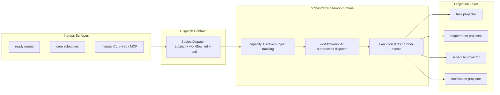
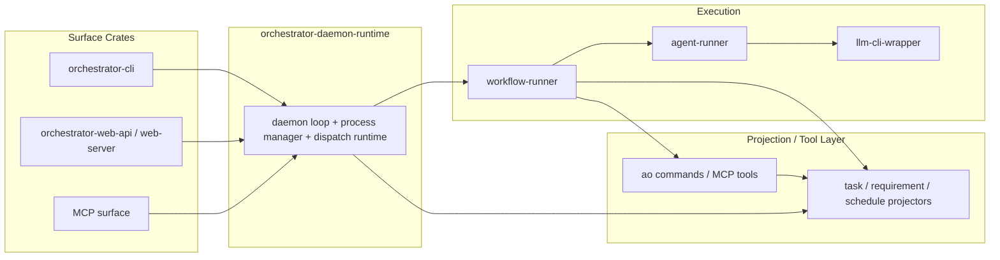

# YAML Workflow Dispatch Daemon Architecture

## Purpose

AO needs one execution model for schedules, ready-queue work, manual starts, and
API or MCP-triggered work. The daemon should not be a task-centric state
machine or a feature host. It should be a dumb, pluggable runtime that accepts
dispatchable work, manages capacity and subprocesses, and emits execution
facts.

Advanced AI behavior should live in YAML-defined workflows executed by
`workflow-runner`, not in special Rust planning subsystems.

## Core Decision

The daemon runtime processes `SubjectDispatch`, not raw tasks.

- `SubjectRef` is identity only.
- `SubjectDispatch` is the execution envelope.
- Ingress surfaces produce dispatches.
- The daemon runtime consumes dispatches and emits execution facts.
- Tool surfaces and projectors apply those facts back to tasks, requirements,
  schedules, and notifications.

## Definitions

### `SubjectRef`

Identity of the work item:

- `task`
- `requirement`
- `custom`

`SubjectRef` does not own execution configuration.

### `SubjectDispatch`

Execution envelope for a subject. At minimum it should include:

- `subject`
- `workflow_ref`
- `input`
- `trigger_source`
- `priority`
- `requested_at`
- optional idempotency or dispatch key

`workflow_ref` belongs here, not on `SubjectRef`.
It should point to a YAML-defined workflow entry, not a hardcoded Rust workflow
type.

### Ingress Surface

Produces `SubjectDispatch` values from:

- ready queue
- cron schedules
- manual CLI, web, or MCP starts

The ingress layer may consult schedules, queue state, or explicit user input,
but it should output dispatchable work rather than owning daemon runtime
behavior. There is no requirement for a first-class Rust planning crate.

### Daemon Runtime

Consumes dispatches, manages capacity, spawns `workflow-runner`, tracks active
subjects, and emits execution facts.

The daemon runtime should know about:

- subjects
- dispatch envelopes
- slots and headroom
- subprocess lifecycle
- runner telemetry
- workflow execution events

The daemon runtime should not own task status policy, backlog promotion, retry
policy, requirement-specific state transitions, or advanced AI feature logic.

### Workflow Runner

`workflow-runner` resolves `workflow_ref` from YAML and executes phases. This is
where advanced AI features should live:

- requirement planning
- task generation
- refinement or review workflows
- follow-up queue management
- any agentic behavior that needs models, tools, or prompts

### Projectors

Project execution facts back onto domain state:

- task projector
- requirement projector
- schedule projector
- notification projector

Projectors are where state-specific updates belong.

## Target Flow

## Crate Responsibilities

## Non-Goals

These responsibilities should not stay in the daemon core:

- task blocking policy
- backlog promotion rules
- task retry policy
- requirement lifecycle transitions
- schedule history projection
- notification formatting
- AI task generation
- requirement refinement logic
- Git workflow policy beyond runtime-safe dispatch mechanics

If the daemon needs those outcomes, it should emit facts that a projector or
tool surface consumes.

## Migration Guidance

### Keep

- `workflow-runner` as the canonical execution host
- `agent-runner` as the process supervisor for model CLIs
- `SubjectRef` as the stable identity model
- YAML as the source of truth for advanced workflows

### Change

1. Replace task-first daemon entrypoints with `SubjectDispatch`.
2. Replace the remaining pipeline-centric dispatch semantics with YAML `workflow_ref`.
3. Move task, requirement, and schedule writeback logic into projector or tool services.
4. Replace special Rust AI task generation paths with YAML workflows executed by `workflow-runner`.
5. Keep `orchestrator-cli` as command parsing, launching, and output only.

## Acceptance Shape

The architecture is correct when:

- every workflow start is expressed as `SubjectDispatch`
- every dispatch points to a YAML workflow via `workflow_ref`
- the daemon runtime can run standalone without task-specific policy
- task, requirement, and schedule state changes happen in projectors
- or validated command or MCP tool surfaces
- manual starts, schedules, and queue dispatch all share the same dispatch contract
- `workflow-runner` remains the only workflow execution host
- advanced AI features are implemented as YAML workflows, not daemon-native Rust features

See also:

- `docs/architecture/tool-driven-mutation-surfaces.md` for the command and MCP
  mutation model that should sit on top of this runtime architecture.
