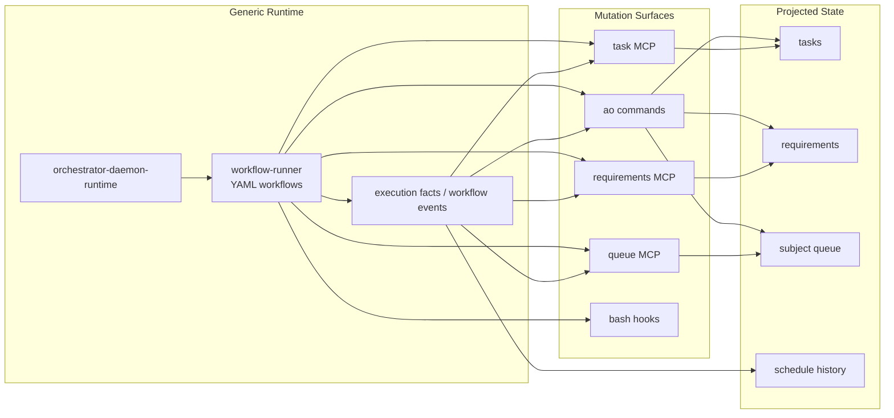

# Tool-Driven Mutation Surfaces

## Purpose

AO should keep daemon and workflow execution generic.

The daemon runtime should schedule and dispatch `SubjectDispatch` values, manage
capacity, track active work, and emit execution facts. `workflow-runner` should
execute YAML-defined workflows and report workflow events. Neither layer should
own task, requirement, or queue business policy directly.

Domain state changes should happen through explicit command and MCP surfaces.

## Core Decision

Task, requirement, and queue mutation are tool surfaces, not daemon-core
behavior.

- The daemon runtime consumes `SubjectDispatch` and emits facts.
- `workflow-runner` executes YAML phases and can call tools.
- Agents and phases mutate domain state by invoking `ao` commands or MCP tools.
- Projectors and reconcilers may also use the same validated mutation surfaces.
- The queue is managed through explicit `SubjectDispatch` commands, not hidden
  daemon-local task logic.

## Runtime Boundary

The daemon and workflow execution layers should know about:

- `ProjectRef` and canonical project-root resolution
- `SubjectRef`
- `SubjectDispatch`
- execution facts and workflow events
- slots, capacity, and subprocess lifecycle

They should not directly own:

- task close or reopen semantics
- requirement refinement semantics
- queue reprioritization semantics
- provider-specific entity semantics
- external system state mutation

## Mutation Surfaces

### Queue

Queue mutation should be exposed through typed commands or MCP tools that work
with `SubjectDispatch`:

- enqueue
- dequeue
- reprioritize
- pause or resume dispatch
- inspect queued and active dispatches

### Tasks

Task mutation should be exposed through typed commands or MCP tools:

- set status
- assign or unassign
- block with reason
- link workflow or requirement
- create follow-up work

### Requirements

Requirement mutation should be exposed through typed commands or MCP tools:

- refine
- update status
- add or adjust acceptance criteria
- create derived tasks

## Workflow Phases

Workflow YAML phases may invoke:

- `ao` commands
- MCP tools
- bash commands

When a phase needs to mutate AO state, typed command or MCP surfaces are
preferred over raw shell-side file edits.

Examples:

- close a task after a successful implementation phase
- refine a requirement after research
- enqueue a follow-up `SubjectDispatch`
- reprioritize the queue based on workflow output
- generate tasks from a requirement by calling typed `ao` or MCP mutation tools

## Plugins and Modules

Tasks, requirements, project refs, and subject adapters can come from modules or
plugins, but the core runtime contract remains stable.

Good extension points:

- `SubjectResolver`
- `DispatchPlanner`
- `ExecutionProjector`
- `TaskProvider`
- `RequirementProvider`
- `QueueProvider`

The runtime contract should stay stable even when providers change.

## Target Shape

## Acceptance Shape

The architecture is correct when:

- daemon and workflow execution are subject- and fact-oriented, not task-aware
- task, requirement, and queue mutation happen through validated command or MCP
  surfaces
- workflow phases can manage AO state using commands or MCP tools
- advanced AI features are expressed as YAML workflows plus tool calls, not
  daemon-native Rust features
- queue operations are expressed in terms of `SubjectDispatch`
- provider or plugin modules can supply subject and project adapters without
  changing daemon-core contracts
