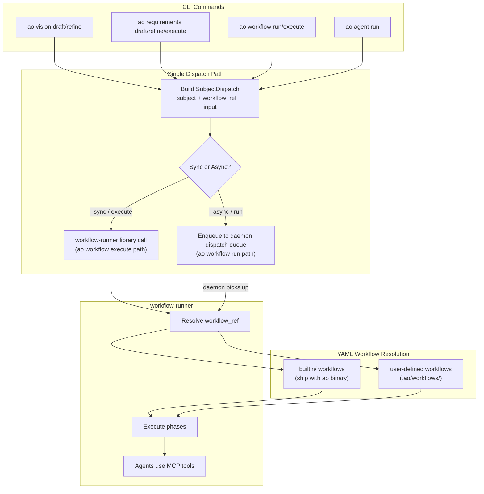

# Workflow-First CLI Architecture

## Purpose

The CLI's core purpose is to execute YAML workflows defined under `.ao/workflows/`.
Every command that involves AI should dispatch a `SubjectDispatch` pointing at a
YAML workflow. No command should directly spawn an LLM runner with hardcoded prompts.

This document defines the target architecture, what needs to change, and the
migration plan.

## Core Decision

CLI commands that invoke AI are workflow dispatchers, not AI executors.

- `ao vision draft` dispatches `builtin/vision-draft` workflow
- `ao requirements draft` dispatches `builtin/requirements-draft` workflow
- `ao requirements execute` dispatches `builtin/requirements-execute` workflow
- `ao agent run` dispatches an ad-hoc single-phase workflow

The CLI never directly constructs prompts, spawns runners, or parses LLM output.
That is `workflow-runner`'s job.

## What Exists Today

### Hardcoded LLM Operations (to be converted)

These commands bypass `workflow-runner` and directly invoke the agent-runner
with inline Rust prompt templates:

| Command | Current Implementation | Prompt Location |
|---------|----------------------|-----------------|
| `ao vision draft` | `draft_vision_with_ai_complexity()` | `ops_planning/prompt_template.rs` |
| `ao vision refine` | `run_vision_refine()` | `ops_planning/refinement_runtime.rs` |
| `ao requirements draft` | `run_requirements_draft()` | `ops_planning/requirements_runtime.rs` |
| `ao requirements refine` | `run_requirements_refine()` | `ops_planning/requirements_runtime.rs` |
| `ao agent run` | `handle_agent_run()` | `runtime_agent.rs` |

**Problem:** These operations use a completely different execution path from
workflow-driven work. They can't benefit from workflow features (rework loops,
gates, checkpoints, sub-workflows, post-success actions). They can't be scheduled,
monitored, or composed with other workflows.

### Workflow-Driven Operations (already correct)

These commands go through the `SubjectDispatch` → `workflow-runner` path:

| Command | Execution Path |
|---------|---------------|
| `ao workflow run` | Async via daemon dispatch queue |
| `ao workflow execute` | Sync via `workflow-runner` library |

### CRUD / Monitor / Infrastructure (no change needed)

These don't invoke AI and stay as-is.

## Target Architecture



### Builtin Workflow Library

Builtin workflows ship as embedded YAML in the `ao` binary (similar to how
`agent-runtime-config.v2.json` is currently bundled). Users can override them
by placing a file with the same `workflow_ref` in `.ao/workflows/`.

```
builtin/
├── vision-draft.yaml          # ao vision draft
├── vision-refine.yaml         # ao vision refine
├── requirements-draft.yaml    # ao requirements draft
├── requirements-refine.yaml   # ao requirements refine
├── requirements-execute.yaml  # ao requirements execute
└── agent-run.yaml             # ao agent run (single-phase wrapper)
```

### Command Dispatch Flow

After conversion, every AI command follows the same flow:

```
1. CLI parses args
2. CLI builds SubjectDispatch {
     subject: derived from args (Task, Requirement, or Custom),
     workflow_ref: "builtin/<command-name>" or user-specified,
     input: { cli_flags, context },
   }
3. CLI decides sync vs async:
     - ao vision/requirements: sync by default (stream output)
     - ao workflow run: async (daemon picks up)
     - ao workflow execute: sync
4. Execute:
     - Sync: call workflow-runner library directly, stream phase output
     - Async: enqueue SubjectDispatch, return dispatch ID
5. workflow-runner resolves YAML, executes phases, agents use MCP tools
6. Output streamed back to CLI (sync) or available via ao output (async)
```

## Migration Plan

### Phase 1: Builtin Workflow Definitions

Create the YAML workflow definitions that replicate current hardcoded behavior.

**Tasks:**
1. Define `builtin/vision-draft.yaml` — single-phase workflow with vision analyst agent
2. Define `builtin/vision-refine.yaml` — single-phase workflow with refinement agent
3. Define `builtin/requirements-draft.yaml` — multi-phase workflow:
   - Phase 1: Initial requirements generation
   - Phase 2: Quality repair loop (replaces `repair_candidates_until_quality_passes`)
   - Phase 3: PO perspective merge (replaces `draft_requirements_with_po_agents`)
4. Define `builtin/requirements-refine.yaml` — single-phase workflow with refinement agent
5. Define `builtin/requirements-execute.yaml` — multi-phase workflow:
   - Phase 1: Analyze requirements and plan decomposition
   - Phase 2: Create tasks via `ao.task.create` MCP tool
   - Phase 3: Queue workflows for created tasks

**Key insight:** The current `requirements draft` has a multi-stage pipeline
(initial draft → quality repair → PO perspectives). This maps naturally to
workflow phases with a rework loop on the quality check phase.

### Phase 2: Sync Dispatch Path

Build the "sync workflow execute" path for planning commands.

**Tasks:**
1. Add `workflow_ref` resolution for `builtin/` prefix (embedded YAML lookup)
2. Wire `ao vision draft` to build `SubjectDispatch` and call `workflow-runner` sync
3. Wire `ao requirements draft` to build `SubjectDispatch` and call `workflow-runner` sync
4. Wire `ao requirements refine` to build `SubjectDispatch` and call `workflow-runner` sync
5. Wire `ao requirements execute` to build `SubjectDispatch` and call `workflow-runner` sync
6. Ensure output streaming works (phase-by-phase output back to terminal)

### Phase 3: Remove Hardcoded Paths

Delete the old direct-runner code paths.

**Tasks:**
1. Remove `ops_planning/draft_runtime.rs` (vision draft hardcoded path)
2. Remove `ops_planning/refinement_runtime.rs` (vision refine hardcoded path)
3. Remove `ops_planning/requirements_runtime.rs` (requirements draft/refine hardcoded path)
4. Remove `ops_planning/requirements_prompt.rs` (hardcoded prompt templates)
5. Remove `ops_planning/prompt_template.rs` (vision complexity prompt)
6. Move prompts into YAML workflow system_prompt fields
7. Delete direct runner connection code from planning handlers

### Phase 4: Agent Run Unification

Convert `ao agent run` to dispatch a single-phase workflow.

**Tasks:**
1. Define `builtin/agent-run.yaml` — single-phase workflow with configurable agent
2. Wire `ao agent run` to build `SubjectDispatch` and execute sync
3. Remove direct runner spawn from `handle_agent_run()`

## Acceptance Criteria

The architecture is correct when:

- Every AI-invoking CLI command dispatches a `SubjectDispatch` with a `workflow_ref`
- No CLI command directly constructs prompts or spawns LLM runners
- `workflow-runner` is the only code that talks to `agent-runner`
- Builtin workflows are YAML definitions that users can inspect and override
- Planning commands (`vision`, `requirements`) use the same execution path as task workflows
- `ao workflow execute` and planning commands share the sync execution path
- `ao workflow run` and daemon-scheduled work share the async execution path
- The `ops_planning/` directory contains only dispatch wiring, no prompt construction

## Relationship to Other Requirements

| Requirement | Relationship |
|-------------|-------------|
| REQ-039 (Dumb Daemon) | This extends REQ-039 to the CLI layer — the CLI becomes equally dumb |
| REQ-034 (Standalone Runner) | Builtin workflows use the same runner that task workflows use |
| REQ-038 (Runner Parity) | Planning workflows must have parity with task workflows |
| REQ-036 (Unified YAML Config) | Builtin workflows use the same YAML schema as user workflows |
| REQ-031 (Composable Pipelines) | Builtin workflows can use sub-workflows, guards, rework loops |

## Non-Goals

- Removing CRUD commands (they stay as direct state operations)
- Removing monitoring commands (they stay as direct state queries)
- Making the daemon aware of planning workflows (it just dispatches SubjectDispatch)
- Breaking existing workflow YAML schema (builtin workflows use the same schema)

## File Locations

**To create:**
- `crates/orchestrator-cli/builtin-workflows/` — embedded YAML workflow definitions
- Or compile into binary via `include_str!()` / build.rs

**To modify:**
- `crates/orchestrator-cli/src/services/operations/ops_planning/mod.rs` — replace with dispatch
- `crates/orchestrator-cli/src/services/runtime/runtime_agent.rs` — replace with dispatch
- `crates/workflow-runner/src/` — add builtin workflow resolution

**To delete:**
- `crates/orchestrator-cli/src/services/operations/ops_planning/draft_runtime.rs`
- `crates/orchestrator-cli/src/services/operations/ops_planning/refinement_runtime.rs`
- `crates/orchestrator-cli/src/services/operations/ops_planning/requirements_runtime.rs`
- `crates/orchestrator-cli/src/services/operations/ops_planning/requirements_prompt.rs`
- `crates/orchestrator-cli/src/services/operations/ops_planning/prompt_template.rs`
- `crates/orchestrator-cli/prompts/ops_planning/` — prompt template files
