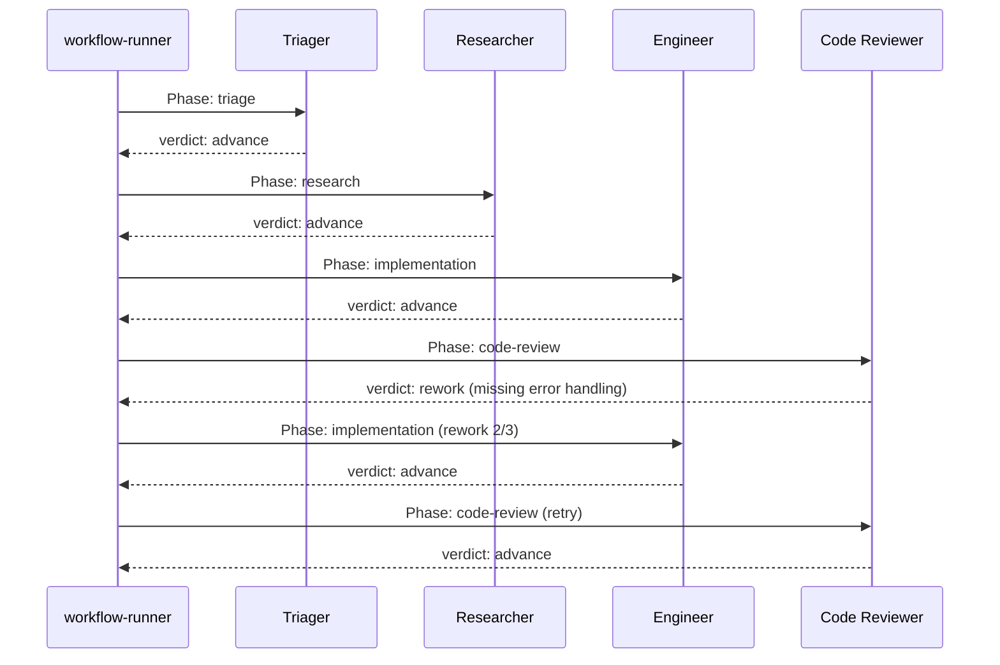

# Agents and Phases

## What an Agent Is

An agent is a specialized AI persona. Each agent has a system prompt that defines its role, a model that powers it, and a set of [MCP tools](./mcp-tools.md) it can use. Agents are defined in [workflow YAML](./workflows.md) and instantiated by `workflow-runner` when a phase executes.

An agent is not a long-running process. It is created for a phase, executes, returns a verdict, and is torn down.

### Agent Profile Fields

```yaml
agents:
  senior-engineer:
    model: claude-sonnet-4-6
    system_prompt: |
      You are a senior software engineer. Write production-quality code,
      run tests, and commit your changes.
    mcp_servers: [ao, github]
```

| Field | Purpose |
|-------|---------|
| `model` | The LLM model to use (e.g. `claude-sonnet-4-6`, `gemini-3.1-pro-preview`). |
| `system_prompt` | Role-specific instructions that shape the agent's behavior. |
| `mcp_servers` | List of MCP server names (defined at the workflow level) the agent can call. |

---

## Built-in Agent Roles

The standard task workflow defines these agent roles:

| Agent | Role | Typical MCP Tools |
|-------|------|-------------------|
| `triager` | Validates tasks, detects duplicates, checks preconditions | ao |
| `researcher` | Gathers evidence, explores codebase, searches documentation | ao, web-search |
| `senior-engineer` | Writes production code, runs tests, commits | ao, github |
| `code-reviewer` | Reviews diffs for bugs, edge cases, style issues | ao, github |
| `security-reviewer` | Validates against security best practices, checks for secrets | ao |
| `integration-tester` | Runs test suites, checks coverage thresholds | ao |
| `po-reviewer` | Verifies acceptance criteria are met, updates checklists | ao |

These are defined in workflow YAML, not hardcoded. You can modify them or define entirely new agent roles.

---

## Phase Execution

A workflow pipeline is a sequence of phases. Each phase is assigned to an agent. `workflow-runner` executes phases sequentially, spawning the appropriate agent for each one.



Each phase receives:
- The agent's system prompt
- Task context (subject identity, prior phase outputs)
- Access to its configured MCP tools

---

## PhaseDecision

When an agent completes a phase, it produces a `PhaseDecision`. The decision determines what happens next.

| Decision | Effect |
|----------|--------|
| **advance** | Move to the next phase in the pipeline. |
| **rework** | Return to a previous phase (typically the implementation phase) with failure context. |
| **skip** | Skip this phase and move to the next one. |
| **fail** | Halt the workflow. Emit a failure fact. |

The workflow-runner evaluates the decision against the phase's guards and transitions to determine the actual next step.

## Target Contract Direction

The long-term model is that every phase, not just agent review phases, ends in
the same verdict-driven control contract. The shared core should stay stable:

- `verdict`
- `reason`
- `confidence`
- `risk`
- `evidence`

Each phase can then add YAML-defined phase-local fields such as `skip_reason`,
`exit_code`, or `failing_tests`. See [Phase Contracts](../architecture/phase-contracts.md).

---

## Rework Loops

Rework is the quality guarantee. When a review phase finds issues, it sends work back to the implementation phase with context about what needs fixing.

Each phase has a configurable `max_rework_attempts` (default varies by workflow). The rework counter tracks how many times a phase has been revisited.

```yaml
phases:
  - id: implementation
    agent: senior-engineer
    max_rework_attempts: 3
  - id: code-review
    agent: code-reviewer
    on_verdict:
      rework: { target: implementation }
      advance: { target: testing }
```

### Rework flow

1. Code reviewer returns `verdict: rework` with context ("missing error handling on line 42").
2. workflow-runner checks the rework counter for the `implementation` phase.
3. If under the limit, it re-enters `implementation` with the failure context appended.
4. The engineer agent sees the feedback, fixes the issue, and returns `advance`.
5. Code review runs again.

If `max_rework_attempts` is exhausted, the workflow fails and emits a failure execution fact.

---

## Phase Guards

Phases can define guards that control whether they execute and how verdicts are routed.

### skip_if

Skip a phase based on a condition:

```yaml
phases:
  - id: security-review
    agent: security-reviewer
    skip_if: ["task.type == 'docs'"]
```

If the condition matches, the phase is skipped and execution advances to the next phase.

### on_verdict

Route execution based on the phase's outcome:

```yaml
phases:
  - id: code-review
    agent: code-reviewer
    on_verdict:
      rework: { target: implementation }
      advance: { target: testing }
      fail: { target: escalation }
```

This allows non-linear pipeline flows where different outcomes lead to different next steps.
