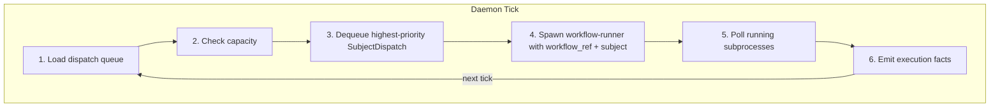
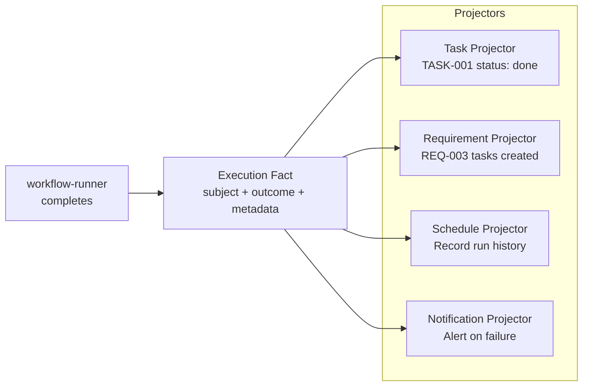

# The Daemon

## Dumb Scheduler, Not a Feature Host

The AO daemon is a scheduler. It consumes [SubjectDispatch](./subject-dispatch.md) envelopes, manages subprocess capacity, spawns `workflow-runner` processes, and emits execution facts. It does not contain AI logic, task policy, or business rules.

This deliberate simplicity keeps the daemon generic. Advanced behavior lives in [YAML workflows](./workflows.md) executed by `workflow-runner`.

---

## The Tick Loop

The daemon operates on a periodic tick (default: every 5 seconds). Each tick follows the same sequence:



### Step by step

1. **Load dispatch queue** -- Read queued `SubjectDispatch` values, ordered by priority and `requested_at`.
2. **Check capacity** -- Determine how many new workflows can be started given the current slot usage and headroom configuration.
3. **Dequeue** -- Pop the highest-priority dispatch that fits within capacity.
4. **Spawn** -- Start a `workflow-runner` subprocess, passing the `workflow_ref`, subject identity, and input. A [worktree](./worktrees.md) is created for task subjects.
5. **Poll** -- Check all active `workflow-runner` subprocesses for completion, telemetry, or failure.
6. **Emit facts** -- Publish execution facts (workflow started, phase completed, workflow succeeded/failed) for projectors to consume.

---

## Capacity Management

The daemon controls concurrency through three mechanisms:

| Control | Description |
|---------|-------------|
| **Max concurrent workflows** | Hard limit on how many `workflow-runner` subprocesses can run simultaneously. |
| **Slot headroom** | Reserve slots so the system is never fully saturated. Allows high-priority work to preempt. |
| **Priority ordering** | Dispatches are dequeued in priority order. Within the same priority, earlier `requested_at` wins. |

The daemon tracks active subjects to prevent duplicate dispatches for the same subject.

---

## What the Daemon Knows vs. Does Not Know

### Knows about

- **Subjects** -- `WorkflowSubject` identity (Task, Requirement, Custom).
- **Dispatch envelopes** -- `SubjectDispatch` with `workflow_ref`, priority, trigger source.
- **Slots and headroom** -- How many workflows are running, how many can start.
- **Subprocess lifecycle** -- PID tracking, health checks, orphan detection on restart.
- **Runner telemetry** -- Phase progress, resource usage, timing.
- **Workflow execution events** -- Started, phase completed, succeeded, failed.

### Does NOT know about

- Task status policy (backlog, ready, blocked transitions).
- Backlog promotion rules.
- Retry policy (handled by workflow-runner's rework loop).
- Requirement state transitions.
- AI logic, prompts, or model selection.
- Git workflow policy (branching, merging, PR creation).

These responsibilities belong to [workflow-runner](./workflows.md), [projectors](#execution-facts-and-projectors), or [MCP tool surfaces](./mcp-tools.md).

---

## Execution Facts and Projectors

When a workflow completes (or fails), the daemon emits execution facts. Projectors subscribe to these facts and update domain state accordingly.



The daemon emits facts; it never interprets them. This separation means adding a new projector (e.g. a Slack notifier) does not require changing the daemon.

---

## Starting and Stopping

```bash
ao daemon start --autonomous    # Start daemon in background (forks child process)
ao daemon status                # Check daemon health and active workflows
ao daemon pause                 # Pause dispatch (running workflows continue)
ao daemon resume                # Resume dispatch
ao daemon stop                  # Graceful shutdown
```

When started with `--autonomous`, the daemon forks a child process. Stderr is redirected to `<project_root>/.ao/daemon.log` (with log rotation at 10MB).

### Failure Recovery

- **Daemon crashes** -- On next startup, orphan recovery detects and cleans up stale subprocesses.
- **workflow-runner crashes** -- The daemon detects the process exit and emits a failure fact.
- **Phase fails inside a workflow** -- Handled by workflow-runner's [rework loop](./agents-and-phases.md), not by the daemon.
