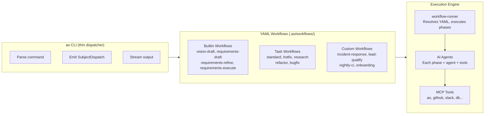
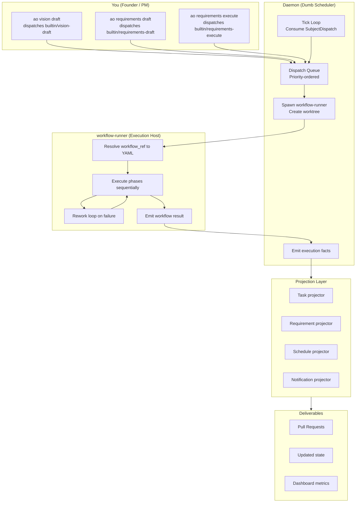
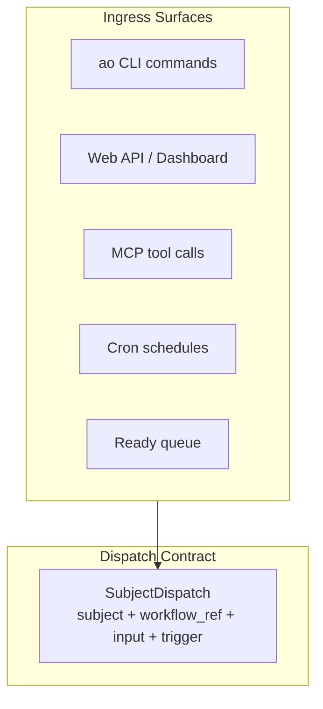
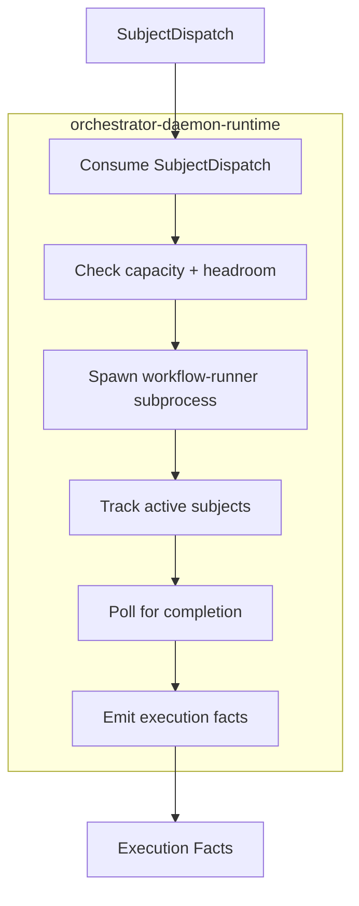
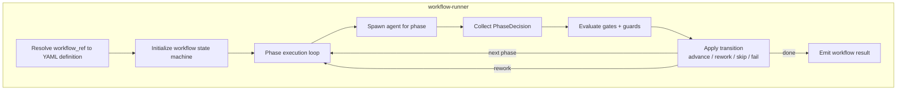

# How AO Works: Core Architecture

## Core Principle

**Everything is a YAML workflow.**

The CLI does not contain AI logic. It dispatches YAML-defined workflows through a single execution path. Vision drafting, requirements generation, code implementation, review -- they are all workflows. The CLI is the remote control. The workflows are the brains.

---

## The Big Picture

Every interaction with AO follows the same path: a surface (CLI, Web, MCP) produces a `SubjectDispatch` envelope, the daemon schedules it, `workflow-runner` executes the YAML workflow, and projectors apply execution facts back to domain state.

---

## Architecture: Three Layers

AO has exactly three layers. Each has a single responsibility.

### Layer 1: Surfaces (CLI, Web, MCP)

Surfaces accept user input and produce [SubjectDispatch](./subject-dispatch.md) values. They never run AI directly.

Every workflow start -- whether from `ao vision draft`, a cron schedule, the ready queue, or an MCP tool call -- produces the same envelope. See [Subject Dispatch](./subject-dispatch.md) for the full field reference.

### Layer 2: Daemon Runtime (Dumb Scheduler)

The [daemon](./daemon.md) consumes `SubjectDispatch`, manages capacity, spawns `workflow-runner` subprocesses, and emits execution facts. It does not know about tasks, requirements, or business logic.

**The daemon knows about:** subjects, dispatch envelopes, slots, headroom, subprocess lifecycle, runner telemetry.

**The daemon does NOT know about:** task status policy, backlog promotion, retry policy, requirement transitions, AI logic, git workflow policy.

### Layer 3: Workflow Runner (Execution Host)

`workflow-runner` resolves `workflow_ref` from YAML and executes phases. This is where all AI behavior lives. See [Agents and Phases](./agents-and-phases.md) for details on phase execution.

---

## Key Architecture Patterns

| Pattern | Description |
|---------|-------------|
| [Subject Dispatch](./subject-dispatch.md) | All work flows through a unified `SubjectDispatch` envelope. One envelope, one execution path. |
| [Dumb Daemon](./daemon.md) | The daemon is a scheduler, not a feature host. It manages capacity and subprocesses. |
| [Tool-Driven Mutation](./mcp-tools.md) | Agents mutate state through MCP tools, not through daemon-internal logic. All changes are auditable. |
| Projectors | Execution facts from `workflow-runner` are projected onto domain state by projectors (task, requirement, schedule, notification). |
| [Worktree Isolation](./worktrees.md) | Every task executes in its own git worktree. Agents can code, test, and commit independently. |
| Self-Correcting Pipelines | The rework loop is the quality guarantee. Code review sends work back with failure context. |
