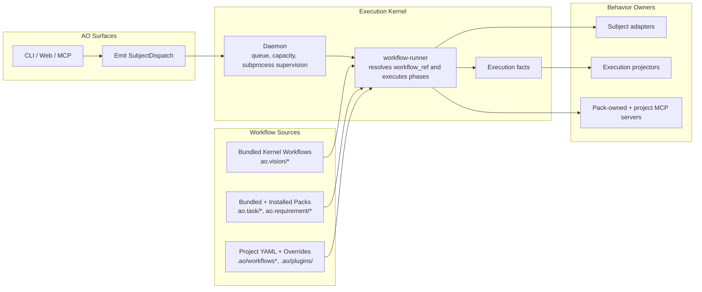

# How AO Works: Core Architecture

## Core Principle

AO is a workflow kernel. Surfaces emit dispatches, the daemon schedules and
supervises subprocesses, and workflows plus packs own behavior.

## The Big Picture

Every interaction follows the same path:

1. A surface creates a `SubjectDispatch`.
2. The daemon schedules the dispatch and supervises the runner subprocess.
3. `workflow-runner` resolves the effective workflow and runtime overlays.
4. Agents and command phases execute using MCP and subprocess tools.
5. Execution facts are projected back onto subject state by subject-aware
   adapters and projectors.

The daemon stays dumb throughout this flow. It never owns task policy,
requirement policy, MCP semantics, or domain-specific routing logic.

## The Three Runtime Layers

### Layer 1: Surfaces

Surfaces accept user intent and produce
[SubjectDispatch](./subject-dispatch.md) values. They do not execute AI or
encode domain behavior.

Examples:

- `ao requirements execute`
- `ao workflow run --ref ao.task/standard`
- `ao mcp serve`
- ready-queue and schedule dispatches

### Layer 2: Daemon Runtime

The [daemon](./daemon.md):

- consumes dispatches
- applies queue ordering and capacity limits
- spawns and supervises workflow subprocesses
- records execution facts

The daemon does not know:

- what a task workflow should do
- how requirement state should change
- which MCP servers a pack needs
- how Node or Python integrations behave

### Layer 3: Workflow Runner

`workflow-runner` is the execution host. It:

- resolves `workflow_ref`
- merges project YAML with pack overlays
- resolves subject context through a subject adapter registry
- executes agent, command, and manual phases
- emits execution facts for projector registries to consume

## Subject and Behavior Boundaries

The kernel only needs a generic subject identity:

- `kind`
- `id`
- optional title and description
- metadata

Subject-specific behavior is delegated to registries:

- subject adapters decide how to resolve context and execution cwd
- execution projectors decide how completion facts update subject state
- packs and MCP descriptors decide which tools and workflows are available

This is what keeps task and requirement behavior out of the daemon.

## Workflow Resolution Today

AO resolves workflows from a layered source model:

1. `.ao/plugins/<pack-id>/`
2. `.ao/workflows.yaml` and `.ao/workflows/*.yaml`
3. `~/.ao/packs/<pack-id>/<version>/`
4. bundled kernel workflows and bundled first-party packs

Canonical workflow refs are pack-qualified, such as `ao.task/standard` and
`ao.requirement/execute`. Legacy `builtin/*` aliases remain as migration
shims, but they are no longer the preferred operator-facing surface.

## MCP and External Runtimes

AO keeps Node and Python process-based:

- packs declare runtime requirements such as `node`, `python`, `uv`, `npm`, or
  `pnpm`
- command phases execute external binaries as subprocesses
- MCP descriptors are declared in pack assets and namespaced by pack id

No external runtime is embedded into AO core.

## Key Patterns

| Pattern | Description |
|---|---|
| Subject dispatch | One envelope for every workflow start |
| Dumb daemon | Scheduling and supervision only |
| Pack-qualified workflow refs | Behavior resolves from packs and YAML, not daemon branches |
| Subject adapters | Subject-kind-specific context resolution and cwd policy |
| Execution projectors | Subject-kind-specific projection of workflow facts |
| Tool-driven mutation | AO state changes happen through MCP/CLI mutation surfaces |

See also: [Workflows](./workflows.md), [MCP Integration](./mcp-tools.md), and
[State Management](./state-management.md).
