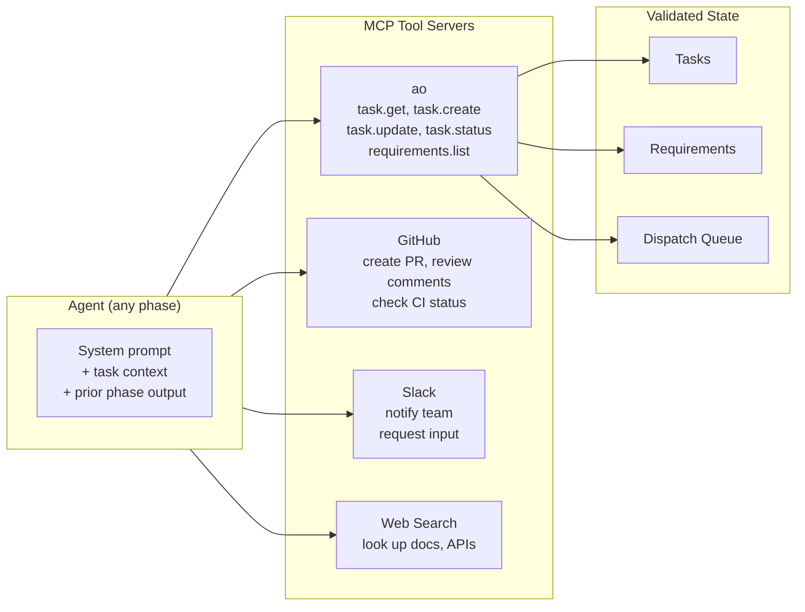

# MCP Integration

## What MCP Is

MCP (Model Context Protocol) is a standard for connecting AI models to external tools and data sources. In AO, MCP is the mechanism through which [agents](./agents-and-phases.md) observe and mutate state.

Rather than giving agents direct filesystem or API access, AO routes all interactions through typed MCP tool calls. This makes every action validated and auditable.

---

## AO's Built-in MCP Server

AO ships with its own MCP server that exposes AO state operations as tools:

```bash
ao mcp serve
```

This server provides tools for all core AO operations:

| Tool | Purpose |
|------|---------|
| `ao.task.get` | Read task details |
| `ao.task.create` | Create a new task |
| `ao.task.update` | Update task fields |
| `ao.task.status` | Change task status |
| `ao.task.checklist-add` | Add checklist items to a task |
| `ao.task.checklist-update` | Update checklist item status |
| `ao.requirements.list` | List requirements |
| `ao.requirements.get` | Read requirement details |
| `ao.workflow.run` | Dispatch a workflow |
| `ao.daemon.health` | Check daemon status |

When an agent needs to create tasks (e.g. during `requirements-execute`), it calls `ao.task.create`. When an engineer marks a checklist item done, it calls `ao.task.checklist-update`. All state changes go through the same validation layer as CLI commands.

---

## External MCP Servers

AO agents can connect to any MCP-compatible server. Common integrations:

| Server | Use Case |
|--------|----------|
| GitHub | Create PRs, read review comments, check CI status |
| Slack | Notify teams, request input, post summaries |
| PostgreSQL | Query database schemas, test data |
| Web Search | Look up documentation, APIs, error messages |
| Notion | Update wikis, project documentation |
| Linear / Jira | Sync with external issue trackers |

---

## Configuring MCP Servers in Workflow YAML

MCP servers are declared at the workflow level and referenced by name in agent definitions:

```yaml
mcp_servers:
  ao:
    command: ao
    args: [mcp, serve]
  github:
    command: npx
    args: [-y, @modelcontextprotocol/server-github]
    env:
      GITHUB_PERSONAL_ACCESS_TOKEN: ${GITHUB_TOKEN}
  slack:
    command: npx
    args: [-y, @anthropic/mcp-server-slack]
    env:
      SLACK_BOT_TOKEN: ${SLACK_BOT_TOKEN}
  web-search:
    command: npx
    args: [-y, @anthropic/mcp-server-web-search]

agents:
  senior-engineer:
    model: claude-sonnet-4-6
    system_prompt: |
      You are a senior software engineer...
    mcp_servers: [ao, github]

  researcher:
    model: claude-sonnet-4-6
    system_prompt: |
      You are a technical researcher...
    mcp_servers: [ao, web-search]
```

Each MCP server entry specifies:

| Field | Purpose |
|-------|---------|
| `command` | The executable to start the MCP server. |
| `args` | Command-line arguments. |
| `env` | Environment variables (supports `${VAR}` substitution from the shell environment). |
| `assign_to` | (Optional) Restrict this server to specific agent IDs. |

MCP servers can also be configured globally in `.ao/config.json` for project-wide availability.

---

## Tool-Driven Mutation

A core architectural principle: agents mutate AO state through MCP tools, not by editing JSON files directly.



This design means:
- All mutations go through the same validation as CLI commands.
- State changes are auditable (every tool call is logged).
- The [daemon](./daemon.md) and workflow-runner stay generic -- they do not contain domain-specific mutation logic.
- External integrations (GitHub, Slack) are first-class -- agents interact with them the same way they interact with AO state.

---

## MCP Tool Prefixes

AO enforces tool prefix whitelisting for security. Agents can only call tools matching their allowed prefixes:

- `ao.` -- AO built-in tools
- `mcp__ao__` -- MCP-prefixed AO tools
- Server-specific prefixes based on the agent's `mcp_servers` list

This prevents agents from calling tools they should not have access to.
