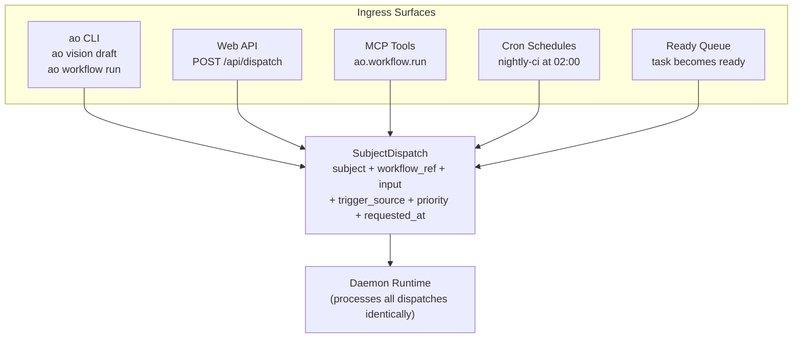

# Subject Dispatch

## What SubjectDispatch Is

`SubjectDispatch` is the universal work envelope in AO. Every workflow execution -- whether triggered by a CLI command, a cron schedule, the ready queue, or an MCP tool call -- starts as a `SubjectDispatch`. It is the single contract between ingress surfaces and the [daemon](./daemon.md) runtime.

The daemon does not care what kind of work is being done. It only processes `SubjectDispatch` envelopes.

---

## WorkflowSubject: Identity Only

A `WorkflowSubject` identifies *what* the work is about. It carries no execution configuration -- that belongs on the dispatch envelope.

There are three variants:

| Variant | Fields | Used For |
|---------|--------|----------|
| `Task` | `id` | Task-driven workflows (e.g. `TASK-001`) |
| `Requirement` | `id` | Requirement workflows (e.g. `REQ-003`) |
| `Custom` | `title`, `description` | Ad-hoc work like vision drafts, one-off agents |

The subject type determines how projectors interpret execution facts. A `Task` subject's completion fact is handled by the task projector. A `Requirement` subject's completion fact is handled by the requirement projector.

---

## SubjectDispatch Fields

```
SubjectDispatch {
    subject:        WorkflowSubject,
    workflow_ref:   String,
    input:          Option<Value>,
    trigger_source: String,
    priority:       Option<String>,
    requested_at:   DateTime<Utc>,
}
```

| Field | Purpose |
|-------|---------|
| `subject` | The `WorkflowSubject` -- identity of the work item. |
| `workflow_ref` | Points to a YAML workflow definition (e.g. `"builtin/vision-draft"`, `"standard-workflow"`). |
| `input` | Optional JSON payload with variables, context, or overrides for the workflow. |
| `trigger_source` | How the dispatch was created: `"manual"`, `"ready-queue"`, `"schedule"`, `"mcp"`. |
| `priority` | Optional priority hint used by the daemon for queue ordering. |
| `requested_at` | UTC timestamp of when the dispatch was requested. |

The `workflow_ref` belongs on the dispatch, not on the subject. The same task can be dispatched through different workflows at different times.

---

## How Every Workflow Start Produces the Same Envelope

No matter how work enters the system, the result is a `SubjectDispatch`:



### Examples

**CLI: vision draft**

```
SubjectDispatch {
    subject: Custom { title: "vision-draft", description: "" },
    workflow_ref: "builtin/vision-draft",
    input: None,
    trigger_source: "manual",
    priority: None,
    requested_at: "2026-03-09T10:00:00Z",
}
```

**Ready queue: task picked up by daemon**

```
SubjectDispatch {
    subject: Task { id: "TASK-042" },
    workflow_ref: "standard-workflow",
    input: None,
    trigger_source: "ready-queue",
    priority: Some("high"),
    requested_at: "2026-03-09T10:05:00Z",
}
```

**MCP tool call: requirement execution**

```
SubjectDispatch {
    subject: Requirement { id: "REQ-007" },
    workflow_ref: "builtin/requirements-execute",
    input: Some({"include_codebase_scan": true}),
    trigger_source: "mcp",
    priority: None,
    requested_at: "2026-03-09T10:10:00Z",
}
```

---

## Why a Single Envelope Matters

A unified dispatch contract means:

- The daemon is generic. It does not need task-specific or requirement-specific code paths.
- New workflow types can be added by writing YAML, not Rust.
- Monitoring, queuing, and capacity management work the same for all work types.
- Every dispatch is auditable through the same event log.

See [The Daemon](./daemon.md) for how dispatches are consumed and [Workflows](./workflows.md) for how `workflow_ref` resolves to YAML.
