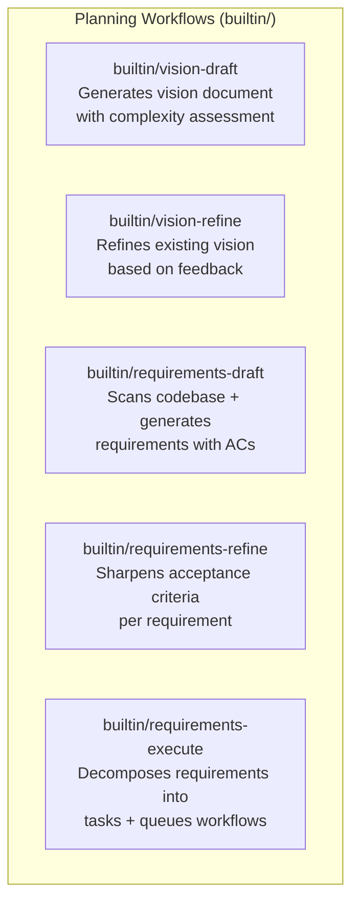

# Workflows

## Everything Is a Workflow

In AO, every AI operation is expressed as a YAML workflow. There is no hardcoded AI logic in the CLI or daemon. The CLI dispatches a [SubjectDispatch](./subject-dispatch.md) pointing at a `workflow_ref`, and `workflow-runner` resolves that reference to a YAML file and executes its phases.

This means vision drafting, requirements generation, code implementation, incident response, and any custom automation all share the same execution path.

---

## Workflow Categories

### Builtin Workflows

These ship with AO and handle the planning lifecycle. They are YAML workflows executed by `workflow-runner`, not hardcoded Rust operations.



### Task Workflows

Task workflows define how work gets done. They are user-defined (or provided as defaults) and referenced when a task is dispatched.

- **standard-workflow** -- Full pipeline: triage, research, plan, implement, review, test, accept.
- **hotfix-workflow** -- Fast-track: triage, implement, fast-track review, test.
- **research-workflow** -- Research-only: research, document, summarize.

### Custom Workflows

Any YAML file in `.ao/workflows/` can define a workflow. Examples:

- **incident-response** -- Investigate, hotfix, deploy.
- **lead-qualify** -- Research, score, notify.
- **nightly-ci** -- Build, test, report.

---

## CLI Command to Workflow Mapping

CLI commands that invoke AI map directly to workflow dispatches:

| Command | Dispatches | Subject |
|---------|-----------|---------|
| `ao vision draft` | `builtin/vision-draft` | `Custom { title: "vision-draft" }` |
| `ao vision refine` | `builtin/vision-refine` | `Custom { title: "vision-refine" }` |
| `ao requirements draft` | `builtin/requirements-draft` | `Custom { title: "requirements-draft" }` |
| `ao requirements refine --ids REQ-001` | `builtin/requirements-refine` | `Requirement { id: "REQ-001" }` |
| `ao requirements execute --ids REQ-001` | `builtin/requirements-execute` | `Requirement { id: "REQ-001" }` |
| `ao workflow run --ref standard-workflow` | `standard-workflow` | `Task { id: "TASK-001" }` |

---

## Workflow YAML Structure

All workflows live in `.ao/workflows/`. A workflow definition includes agents, pipelines, phases, and post-success actions.

### Example: Vision Draft

```yaml
# .ao/workflows/builtin/vision-draft.yaml
id: builtin/vision-draft
name: Vision Draft
description: Generate a vision document with complexity assessment

agents:
  vision-analyst:
    model: claude-sonnet-4-6
    system_prompt: |
      You are a product strategist. Analyze the project context and produce
      a vision document covering: problem statement, target users, goals,
      constraints, value proposition, and complexity assessment.
    mcp_servers: [ao, web-search]

pipelines:
  default:
    phases:
      - id: draft
        agent: vision-analyst
      - id: complexity-assessment
        agent: vision-analyst
        system_prompt_override: |
          Review the draft vision and produce a complexity assessment
          (simple/medium/complex) with justification.
    post_success:
      save_artifact: vision.json
```

### Example: Requirements Execute

```yaml
# .ao/workflows/builtin/requirements-execute.yaml
id: builtin/requirements-execute
name: Requirements Execute
description: Decompose requirements into tasks and queue workflows

agents:
  task-planner:
    model: claude-sonnet-4-6
    system_prompt: |
      You are a technical project manager. Given requirements with acceptance
      criteria, decompose them into concrete implementation tasks. Use ao MCP
      tools to create tasks and link them to requirements.
    mcp_servers: [ao]

pipelines:
  default:
    phases:
      - id: analyze
        agent: task-planner
      - id: create-tasks
        agent: task-planner
        system_prompt_override: |
          Create tasks using ao.task.create for each work item identified.
          Set appropriate priority, type, dependencies, and link to the
          source requirement. Then queue workflows for ready tasks.
```

---

## Supported Workflow Features

| Feature | Description |
|---------|-------------|
| Sequential phases | Phases execute in defined order within a pipeline. |
| Conditional skipping | `skip_if` guards allow phases to be skipped based on conditions. |
| Verdict-based transitions | `on_verdict` routes execution based on phase outcome (advance, rework, skip, fail). |
| Rework loops | `max_rework_attempts` controls how many times a phase can be reworked before failing. |
| Nested sub-workflows | `sub_workflow` delegates to another workflow definition. |
| Pipeline variables | `variables` with defaults can be passed into workflows. |
| Per-phase overrides | Agent and model can be overridden per phase via `system_prompt_override`. |
| MCP server references | Agents reference MCP servers by name, configured at the workflow level. |
| Post-success actions | `auto_merge`, `auto_pr`, `cleanup_worktree` run after all phases pass. |

### Full YAML Schema Reference

```yaml
id: my-workflow
name: My Workflow
description: What this workflow does

mcp_servers:
  ao:
    command: ao
    args: [mcp, serve]
  github:
    command: npx
    args: [-y, @modelcontextprotocol/server-github]
    env:
      GITHUB_PERSONAL_ACCESS_TOKEN: ${GITHUB_TOKEN}

agents:
  my-agent:
    model: claude-sonnet-4-6
    system_prompt: |
      You are a specialized agent...
    mcp_servers: [ao, github]

variables:
  - name: target_branch
    default: main

pipelines:
  default:
    phases:
      - id: phase-1
        agent: my-agent
        max_rework_attempts: 3
        skip_if: ["task.type == 'docs'"]
        on_verdict:
          rework: { target: phase-1 }
          advance: { target: phase-2 }
      - id: phase-2
        agent: my-agent
      - id: nested-pipeline
        sub_workflow: other-workflow-ref
    post_success:
      auto_merge: true
      auto_pr: true
      cleanup_worktree: true
```
