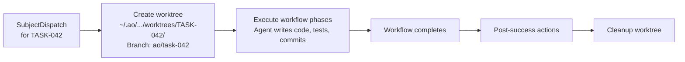

# Worktree Isolation

## Every Task Gets Its Own Worktree

When the [daemon](./daemon.md) dispatches a task workflow, it creates a dedicated git worktree for that task. This means each agent works in its own copy of the repository and can write code, run tests, and commit without interfering with other running tasks or the main checkout.

---

## Worktree Path

Worktrees are stored under the repository-scoped state directory:

```
~/.ao/<repo-scope>/worktrees/<task-id>/
```

Where `<repo-scope>` is the sanitized repository name plus a SHA-256 hash prefix (see [State Management](./state-management.md) for the scoping rules).

For example:

```
~/.ao/my-saas-a1b2c3d4e5f6/worktrees/TASK-042/
```

---

## Branch Naming

Each worktree gets a dedicated branch:

```
ao/<sanitized-task-id>
```

For example, task `TASK-042` gets branch `ao/task-042`. The task ID is sanitized to lowercase with special characters replaced by hyphens, using the same `sanitize_identifier` function used for repository scoping.

---

## Isolation Guarantees

Because each task runs in its own worktree:

- **No file conflicts** -- Two agents implementing different tasks modify files independently.
- **Independent test runs** -- `cargo test` (or any test command) runs against the task's own working tree.
- **Clean git history** -- Each task's commits are on its own branch, making PRs clean and reviewable.
- **No main branch pollution** -- The main checkout stays untouched while tasks execute.

---

## Worktree Lifecycle



### 1. Create

When the daemon spawns `workflow-runner` for a task subject, it creates a git worktree from the current main branch. The worktree is checked out to a new branch named `ao/<task-id>`.

### 2. Execute

All workflow phases run inside the worktree directory. Agents can:

- Read and write files
- Run build and test commands
- Create git commits
- Access MCP tools

The agent's working directory is set to the worktree path.

### 3. Post-success actions

After all phases pass, the workflow can perform post-success actions defined in the YAML:

| Action | Effect |
|--------|--------|
| `auto_pr: true` | Create a pull request from the task branch to the target branch. |
| `auto_merge: true` | Merge the PR after creation (if CI passes). |
| `cleanup_worktree: true` | Remove the worktree directory after merge. |

### 4. Cleanup

When cleanup runs, the worktree directory is removed and the local branch can be pruned. If cleanup is not configured, the worktree persists for manual inspection.

---

## Merge Conflict Recovery

If the task branch has conflicts with the target branch, workflow-runner can attempt AI-powered conflict resolution as a workflow phase. The merge recovery logic detects conflicts, presents them to an agent, and the agent resolves them before committing.

If automatic resolution fails, the workflow is marked as blocked and the conflict is reported for manual intervention.

---

## Managing Worktrees

```bash
ao git worktree list          # List active worktrees
ao git worktree cleanup       # Remove worktrees for completed tasks
ao runner orphans-detect      # Detect orphaned runner processes in stale worktrees
```

The daemon performs orphan recovery on startup, detecting worktrees whose runner processes are no longer alive.
