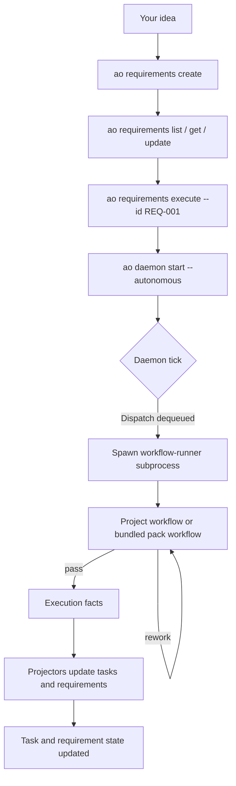

# A Typical Day Using AO

This is the common end-to-end loop: capture a requirement, turn it into tasks,
and let AO run the resulting workflows.

## The Lifecycle



## Typical Flow

### 1. Capture the requirement

```bash
ao requirements create --title "Add rate limiting" --priority high
ao requirements list
ao requirements get --id REQ-001
```

### 2. Refine the scope

```bash
ao requirements update --id REQ-001 --priority critical
ao requirements recommendations scan
```

### 3. Execute the requirement into work

```bash
ao requirements execute --id REQ-001
```

This creates or updates tasks through AO mutation surfaces and can start the
corresponding workflows.

### 4. Let AO run

```bash
ao daemon start --autonomous
```

Project-local workflows usually wrap bundled pack refs such as
`ao.task/standard`.

### 5. Watch progress

```bash
ao task stats
ao workflow list
ao daemon health
ao output monitor --run-id <run-id>
ao status
```

## What the Daemon Actually Does

The daemon:

- dequeues `SubjectDispatch` items
- checks capacity
- spawns runner subprocesses
- records execution facts

The daemon does not own task semantics, requirement semantics, or pack logic.

## Why This Matters

That split lets AO support:

- bundled first-party packs such as `ao.task`
- installed machine packs under `~/.ao/packs/`
- project workflow overrides in `.ao/workflows.yaml` and `.ao/workflows/*.yaml`
- machine-scoped runtime state under `~/.ao/<repo-scope>/`

without expanding daemon responsibilities.
