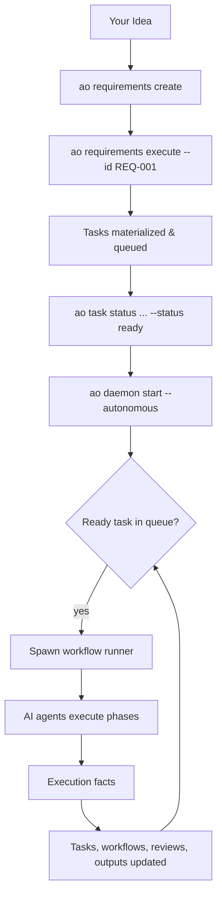

# A Typical Day Using AO

AO is built for continuous, autonomous execution. You define work (requirements or tasks), mark it ready, and the daemon picks it up automatically.

## The Autonomous Workflow



## Typical Flow

### 1. Capture a requirement or task

```bash
# Option A: Start with a product requirement
ao requirements create \
  --title "Rate limiting" \
  --priority must \
  --acceptance-criterion "Requests above the threshold are delayed or rejected"

# Option B: Create a task directly
ao task create \
  --title "Add rate limiting" \
  --task-type feature \
  --priority high
```

### 2. Materialize implementation work

If you created a requirement, execute it to generate tasks:

```bash
ao requirements execute --id REQ-001
```

If you created a task directly, you can skip this step.

### 3. Start the daemon (autonomous mode)

```bash
ao task status --id TASK-001 --status ready
ao daemon start --autonomous
```

The daemon now continuously polls for ready tasks and executes them. It runs in the background and persists across restarts.

### 4. Monitor progress

```bash
ao now
ao daemon health
ao workflow list
ao output tail
ao status
```

## Testing Workflows (Debug Mode)

If you need to test a workflow definition, agent prompt, or MCP tool before enabling the daemon, use the `--sync` flag:

```bash
# Run a single workflow synchronously in your terminal for debugging
ao workflow run --task-id TASK-001 --sync
```

The `--sync` flag is a development and debugging tool—it blocks until the workflow completes in the terminal. Once the workflow definition is validated, enable autonomous execution above.

## What the Daemon Actually Does

The daemon:

- continuously polls for ready work
- respects queue ordering and capacity limits
- spawns workflow runner subprocesses
- records runtime state and execution facts

The daemon does not own task semantics, requirement semantics, or AI logic. That responsibility belongs to [workflow definitions](../concepts/workflows.md) and [agents](../concepts/agents-and-phases.md).

## Architecture: Separation of Concerns

AO splits responsibilities to keep concerns clean:

- **Project configuration** (`.ao/`) stays in your repository, versioned with your code
- **Runtime state** (`~/.ao/<repo-scope>/`) lives outside, persisted across runs
- **Workflow logic** (YAML phases and agent prompts) is authored and committed
- **Daemon** is a generic scheduler—policies live in workflow definitions, not in the daemon

This design lets you customize workflows per repository while keeping the daemon simple and reliable.
