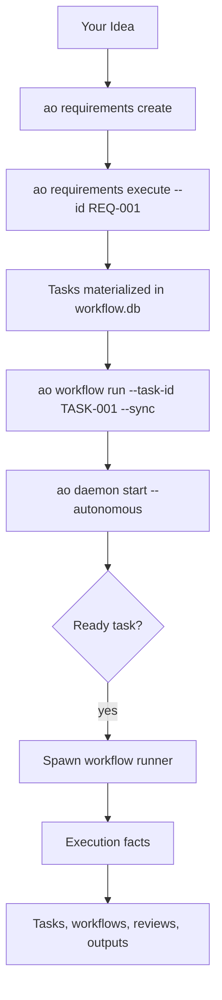

# A Typical Day Using AO

This is the common loop with the current CLI: define work, turn it into tasks, run a workflow, then let the daemon keep going.

## The Lifecycle



## Typical Flow

### 1. Capture a requirement

```bash
ao requirements create \
  --title "Rate limiting" \
  --priority must \
  --acceptance-criterion "Requests above the threshold are delayed or rejected"
```

### 2. Turn the requirement into implementation work

```bash
ao requirements execute --id REQ-001
```

This materializes tasks and any follow-on workflow work associated with the requirement.

### 3. Run a task workflow directly

```bash
ao task prioritized
ao workflow run --task-id TASK-001 --sync
```

### 4. Hand the backlog to the daemon

```bash
ao task status --id TASK-002 --status ready
ao daemon start --autonomous
```

The daemon schedules ready work, supervises runners, and records execution state. Workflow logic still comes from workflow definitions and pack content, not from daemon-specific branches.

### 5. Watch the system

```bash
ao now
ao daemon health
ao workflow list
ao output tail
ao status
```

## What the Daemon Actually Does

The daemon:

- dequeues or discovers ready work
- applies queue ordering and capacity limits
- spawns workflow runner subprocesses
- records runtime state and execution facts

The daemon does not own task semantics or requirement semantics.

## Why This Matters

That split lets AO keep project-local workflow customization in the repo while keeping mutable runtime data and worktrees under `~/.ao/<repo-scope>/`.
