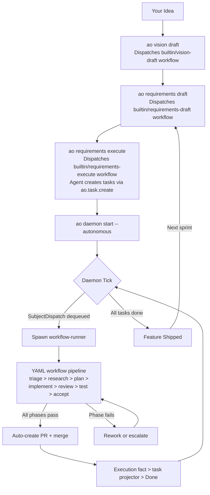
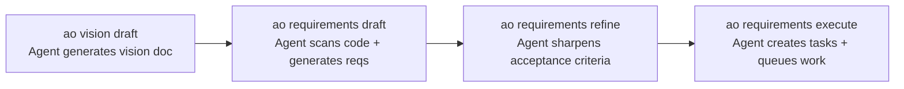
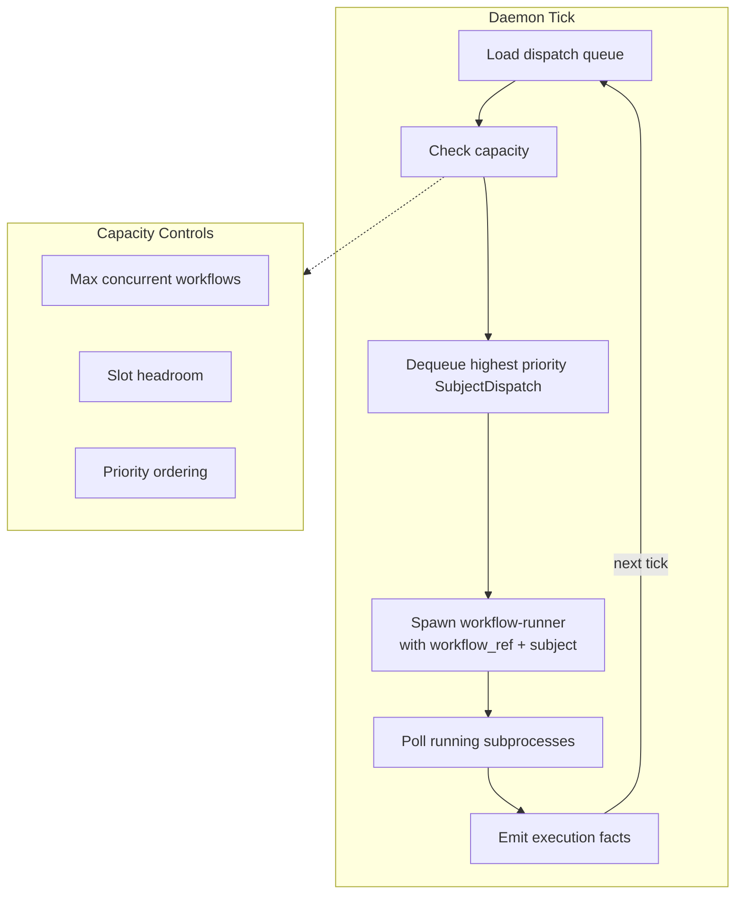
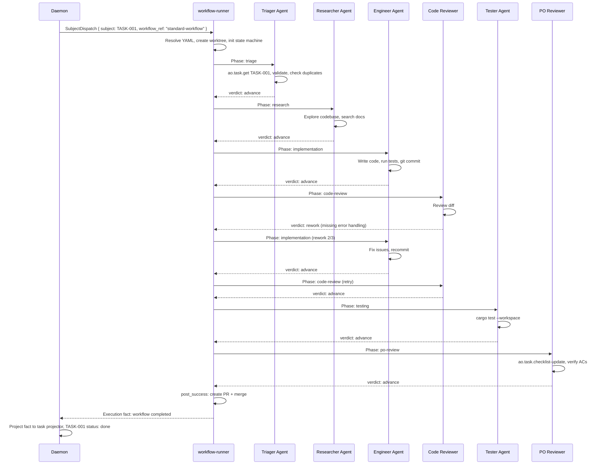

# A Typical Day Using AO

This guide walks through the full lifecycle of using AO to build software, from initial idea to shipped features.

## The Full Lifecycle



## Step-by-Step Walkthrough

### Step 1: Setup

```bash
ao setup
```

This creates `.ao/workflows/` with your workflow definitions and `.ao/state/` for runtime state. See [Project Setup](project-setup.md) for details on what gets created.

### Step 2: Define What You Are Building



Every command dispatches a YAML workflow. The CLI streams output while the agent runs. Under the hood, each command follows the same execution path as any other workflow.

**The hierarchy:**

| Level | Entity | Created By |
|-------|--------|-----------|
| Vision | Single document | `builtin/vision-draft` workflow |
| Requirements | REQ-001..REQ-N | `builtin/requirements-draft` workflow |
| Tasks | TASK-001..TASK-N | `builtin/requirements-execute` workflow (agent uses `ao.task.create` MCP tool) |

### Step 3: Start the Daemon

```bash
ao daemon start --autonomous
```

The daemon runs a tick loop every 5 seconds:



The daemon is a dumb scheduler. It does not know what a "task" is or what "requirements" are. It processes `SubjectDispatch` envelopes, manages subprocess capacity, and emits execution facts.

### Step 4: Workflow Pipeline Executes

Each task runs through a multi-phase pipeline with specialized agents:



Key points:
- Each phase runs a specialized agent with role-specific system prompts and MCP tool access.
- The **rework loop** is the quality guarantee. Code review can send work back to the engineer with failure context, up to a configurable number of attempts.
- Agents mutate AO state through MCP tools (`ao.task.update`, `ao.task.checklist-update`), not by editing JSON files directly.

### Step 5: Monitor Progress

```bash
# Task completion summary
ao task stats

# Daemon status and health
ao daemon status
ao daemon health

# List workflows and their status
ao workflow list

# Check for failed workflows
ao workflow list --status failed

# Stream agent output in real time
ao output tail

# Full project dashboard
ao status

# Web dashboard
ao web serve

# Terminal UI
ao tui
```

### Step 6: Review and Ship

When tasks complete, they produce pull requests:

```bash
# List generated PRs
gh pr list

# Review and merge
gh pr review <number> --approve
gh pr merge <number>
```

## Example: A Typical Day

```
Morning:
  $ ao vision draft
    Dispatches builtin/vision-draft workflow
    Agent analyzes project, generates vision doc
    Vision saved to .ao/state/vision.json

  $ ao requirements draft --include-codebase-scan
    Dispatches builtin/requirements-draft workflow
    Agent scans codebase, generates 12 requirements
    Requirements saved with acceptance criteria

  $ ao requirements execute --requirement-ids REQ-001..REQ-005
    Dispatches builtin/requirements-execute workflow
    Agent creates 15 tasks via ao.task.create MCP tool
    Tasks queued with priorities and dependencies

  $ ao daemon start --autonomous
    Daemon begins tick loop, picks up queued work

Afternoon:
  $ ao task stats
    9 done, 4 in-progress, 2 blocked (waiting on dependency)

  $ ao workflow list --status failed
    1 workflow failed at security-review (hardcoded API key detected)
    Engineer agent auto-reworked, now passing

Evening:
  $ ao task stats
    14 done, 1 in-progress

  $ gh pr list
    14 PRs ready for review
    Review, approve, merge

Next day:
  $ ao requirements execute --requirement-ids REQ-006..REQ-010
    Repeat cycle
```

## Failure Recovery

- **Phase fails**: Retried up to configured max rework attempts.
- **All retries exhausted**: Workflow fails, execution fact emitted, task projector marks the task as blocked.
- **Daemon crashes**: Orphan recovery runs on next startup.
- **Merge conflicts**: AI-powered conflict resolution in workflow phases.

## Next Steps

- [Project Setup](project-setup.md) -- Understand the `.ao/` directory structure.
- [Quick Start](quick-start.md) -- Run your first workflow.
