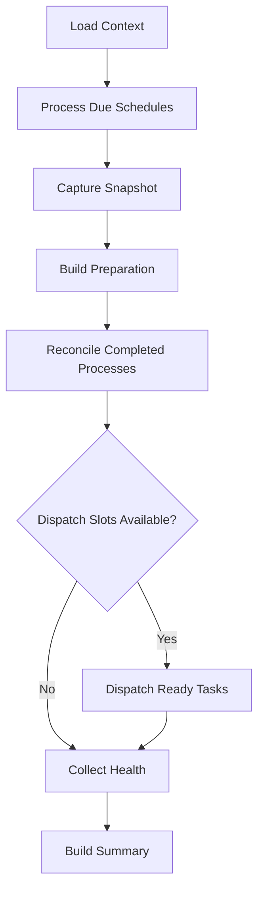

# Daemon Scheduler Internals

The daemon scheduler lives in the `orchestrator-daemon-runtime` crate. It implements the autonomous tick loop that drives workflow dispatch for a project.

## Tick Loop

The entry point is `run_project_tick()` in `crates/orchestrator-daemon-runtime/src/tick/run_project_tick.rs`. Each tick follows this sequence:

1. **Load context** -- Build a `ProjectTickContext` from the project root, daemon options, and current time. This includes schedule evaluation and active-hours gating.
2. **Process due schedules** -- If any cron-based schedules are due, fire their pipeline spawners.
3. **Capture snapshot** -- Load the current project state (tasks, workflows, dispatch queue) into a `ProjectTickSnapshot`.
4. **Build preparation** -- Compute `ProjectTickPreparation` from the snapshot: how many ready dispatch slots are available, what the dispatch limit is.
5. **Reconcile completed processes** -- Poll the `ProcessManager` for finished workflow-runner subprocesses. Record execution facts (success/failure) and update workflow/task state via projectors.
6. **Dispatch ready tasks** -- If dispatch slots are available (`ready_dispatch_limit > 0`), select subjects from the dispatch queue and spawn workflow-runner processes.
7. **Collect health** -- Gather daemon health metrics.
8. **Build summary** -- Assemble a `ProjectTickSummary` with all execution outcomes for logging and event emission.

## Dispatch Queue

The dispatch queue (`crates/orchestrator-daemon-runtime/src/queue/`) maintains an ordered list of `DispatchQueueEntry` items, each representing a subject awaiting execution.

Entry statuses:
- **Pending** -- Enqueued but not yet assigned to a workflow-runner process
- **Assigned** -- A workflow-runner process has been spawned for this entry
- **Completed** -- Terminal state (succeeded or failed)
- **Held** -- Temporarily held back from dispatch (e.g., dependency gate)

Subjects are ordered by priority. The `plan_ready_dispatch()` function in `crates/orchestrator-daemon-runtime/src/dispatch/ready_dispatch_plan.rs` selects which pending entries to start, respecting capacity limits.

## Process Manager

`ProcessManager` in `crates/orchestrator-daemon-runtime/src/dispatch/process_manager.rs` tracks spawned `ao-workflow-runner` child processes.

Responsibilities:
- **Spawn** -- Build the runner command from a `SubjectDispatch`, spawn it as a tokio `Child` process with piped stderr
- **Poll** -- Check which child processes have exited, collecting their exit status and stderr output as `CompletedProcess` entries
- **Track** -- Maintain a list of active `WorkflowProcess` entries with subject ID, task ID, workflow ref, and child handle

The runner command is constructed by `build_runner_command_from_dispatch()` which translates dispatch parameters into CLI arguments for the `ao-workflow-runner` binary.

## Capacity Rules

Dispatch capacity is computed by `ready_dispatch_limit()` and `ready_dispatch_limit_for_options()`:

- **max_workflows** -- Upper bound on total concurrent workflow-runner processes
- **slot_headroom** -- Number of slots reserved to avoid saturating the system
- **fallback_headroom** -- Additional headroom when using fallback tool configurations
- **pool_draining** -- When the daemon is shutting down, no new dispatches are started

The effective limit is: `max_workflows - active_count - headroom`.

## Completion Reconciliation

When a workflow-runner process exits, the `CompletionReconciliationPlan` (from `crates/orchestrator-daemon-runtime/src/dispatch/completion_reconciliation_plan.rs`) determines what state updates to apply:

- Record execution facts via projector functions (`project_task_execution_fact`, `project_schedule_execution_fact`, etc.)
- Update task status based on workflow outcome (success sets task to done, failure sets task to blocked)
- Remove terminal dispatch queue entries
- Emit runner events for monitoring

## Schedule Evaluation

`ScheduleDispatch` in `crates/orchestrator-daemon-runtime/src/schedule/schedule_dispatch.rs` handles cron-based workflow scheduling:

- **Cron parsing** -- Uses the `croner` crate for cron expression evaluation
- **Active hours gate** -- `allows_proactive_dispatch()` checks whether the current time falls within configured active hours before allowing proactive dispatches
- **Due evaluation** -- Compares schedule cron expressions against the last run time stored in `ScheduleState` to determine which schedules are due
- **Dispatch** -- Due schedules are converted into `SubjectDispatch` entries and spawned via the pipeline spawner callback
