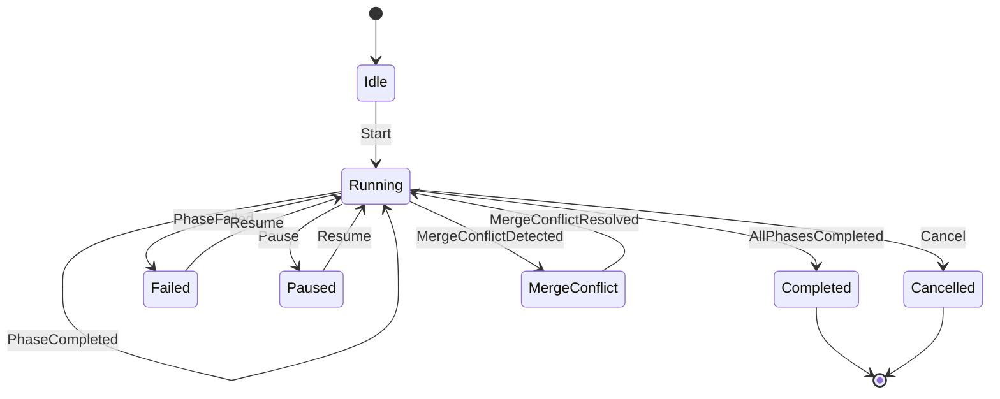
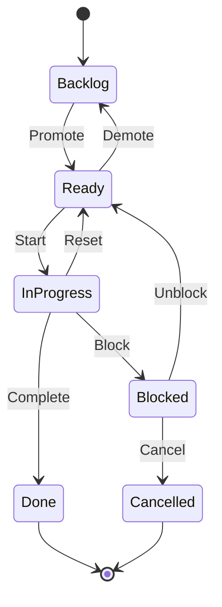

# State Machines

AO uses formal state machines to govern workflow and task lifecycle transitions. State machine definitions can be loaded from a JSON configuration file or use compiled-in defaults.

## Workflow State Machine

The workflow state machine (`crates/orchestrator-core/src/workflow/state_machine.rs`) controls valid workflow transitions.

### States

| State | Description |
|-------|-------------|
| `Idle` | Workflow created but not yet started |
| `Running` | Actively executing phases |
| `Paused` | Execution suspended, can be resumed |
| `Completed` | All phases finished successfully |
| `Failed` | A phase failed and rework attempts are exhausted |
| `Cancelled` | Manually cancelled |
| `MergeConflict` | Post-success merge encountered a conflict |

### Events and Transitions

### Guard Conditions

Transitions can have guard conditions evaluated at runtime. The `evaluate_guard()` function receives a `GuardContext` and returns whether the transition is allowed. Guards enable conditional behavior like:

- Only allow resume if the phase has rework attempts remaining
- Only transition to completed if all phases have passed their gates

The `WorkflowStateMachine` struct wraps the compiled machine definition and exposes `apply()` for simple transitions and `apply_with_guard_context()` for guarded transitions.

## Task Status Transitions

Tasks follow a lifecycle managed by `apply_task_status` in `crates/orchestrator-core/src/services/task_shared.rs`.

### Task Statuses

| Status | Description |
|--------|-------------|
| `Backlog` | Initial state, not yet ready for work |
| `Ready` | Available for dispatch |
| `InProgress` | Currently being worked on |
| `Blocked` | Cannot proceed (dependency, failure, etc.) |
| `Done` | Successfully completed |
| `Cancelled` | Manually cancelled |

### Valid Transitions

When setting task status via `set_status()`, the `validate` parameter controls whether transition rules are enforced. The status application function also clears transient fields:

- Moving to `Ready` clears `paused`, `blocked_at`, `blocked_reason`, and `blocked_by`
- Moving to `Blocked` sets `blocked_at` and `blocked_reason`

## Phase Lifecycle

Individual workflow phases have their own status tracking:

| Status | Description |
|--------|-------------|
| `Pending` | Phase not yet reached in execution order |
| `Ready` | Phase is next in the execution queue |
| `Running` | Agent is actively working on this phase |
| `Success` | Phase completed successfully |
| `Failed` | Phase failed (may trigger rework) |
| `Skipped` | Phase was skipped (gate condition or filter) |

## State Machine Configuration

State machines can be customized per project via `state-machines.v1.json`, stored in the project's scoped state directory.

The `StateMachineMode` enum controls which definition source is used:

| Mode | Behavior |
|------|----------|
| `Builtin` | Use compiled-in Rust definitions only |
| `Json` | Load from JSON file, fall back to builtin on parse errors |
| `JsonStrict` | Load from JSON file, fail on parse errors |

The mode is controlled by the `AO_STATE_MACHINE_MODE` environment variable (default: `Json`).

The `LoadedStateMachines` struct contains:
- `compiled` -- The `CompiledStateMachines` with ready-to-use workflow and requirement lifecycle machines
- `warnings` -- Any validation warnings from the JSON load
- `path` -- The path the JSON file was loaded from

The state machines module (`crates/orchestrator-core/src/state_machines/`) includes:
- `schema.rs` -- JSON schema definitions and builtin defaults
- `engine.rs` -- Compiled machine evaluation, guard evaluation, transition application
- `validator.rs` -- Validation of state machine documents against expected invariants
