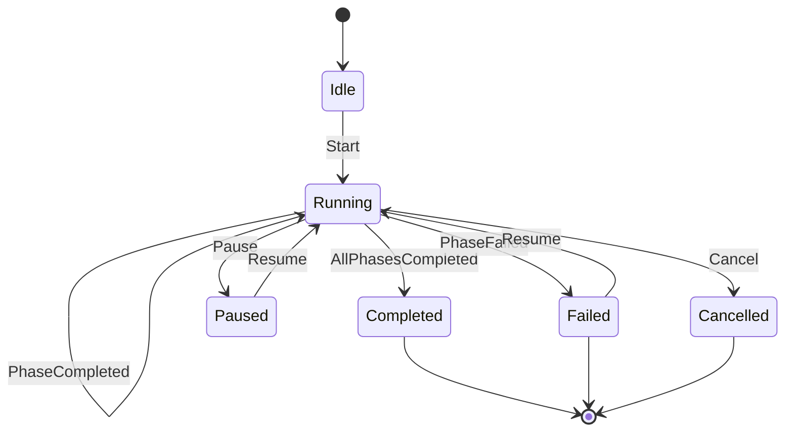

# Workflow Runner Internals

The `workflow-runner` crate provides both a library and a standalone binary (`ao-workflow-runner`). It executes workflow phases by coordinating with the agent runner and managing the workflow lifecycle.

## YAML Resolution

When a workflow is started, the runner resolves the `workflow_ref` to a compiled workflow definition:

1. Load the compiled workflow config from the project's state directory
2. Look up the workflow definition by its ref identifier
3. Resolve the phase plan -- which phases to execute, in what order, with what configuration
4. Expand workflow variables and apply any phase filters

The configuration crate (`orchestrator-config`) handles YAML parsing, variable expansion (`expand_variables`), and compilation (`compile_yaml_workflow_files`).

## Phase Execution Loop

The main execution function (`workflow_execute.rs`) iterates through the resolved phase plan:

```
for each phase in phase_plan:
    1. Ensure execution CWD exists (branch checkout, worktree setup)
    2. Build runtime contract (tool, model, system_prompt, variables)
    3. Spawn agent via IPC client
    4. Collect phase decision from agent output
    5. Evaluate phase gates and transition rules
    6. If failed and rework attempts remain, re-enter phase with failure context
    7. Persist phase output
```

Phase events (`PhaseEvent::Started`, `PhaseEvent::Decision`, `PhaseEvent::Completed`) are emitted to an optional callback for monitoring.

## State Machine

The workflow state machine (`crates/orchestrator-core/src/workflow/state_machine.rs`) governs valid transitions:



Guard conditions can be attached to transitions. The `evaluate_guard()` function checks runtime context (e.g., whether rework attempts are exhausted) to determine if a transition is allowed.

## Rework Loops

When a phase fails, the runner checks whether rework is allowed:

- `max_rework_attempts` (default from `DEFAULT_MAX_REWORK_ATTEMPTS`) limits how many times a phase can retry
- On failure, the `PhaseFailureClassifier` categorizes the error to determine if rework is appropriate
- If rework is attempted, the failure context (error message, previous output) is passed back to the agent as additional context in the next attempt
- If rework attempts are exhausted, the workflow transitions to Failed

## IPC Client

The workflow runner connects to the agent runner via the IPC client defined in `crates/workflow-runner/src/ipc.rs`. The connection flow:

1. Connect to the agent runner's Unix domain socket (or TCP on Windows)
2. Authenticate with a token-based handshake
3. Send an agent run request with the runtime contract
4. Stream `AgentRunEvent` messages from the socket
5. Parse events to extract phase decisions, tool call results, and artifacts

## Runtime Contract Construction

The runtime contract builder (`crates/workflow-runner/src/executor/runtime_contract_builder.rs`) assembles the parameters sent to the agent:

- **Tool** -- Which CLI tool to use (claude, codex, gemini, opencode), resolved from phase config or agent profile
- **Model** -- Which LLM model to target, with cascade: phase runtime override > agent profile > compiled defaults
- **System prompt** -- Assembled from phase prompt templates with variable substitution
- **Variables** -- Workflow-level and phase-level variables merged together
- **Capabilities** -- Read-only flags, response schema flags, and other tool-specific capabilities

The `PhaseTargetPlanner` handles tool/model selection with fallback logic, including the `enforce_write_capable_phase_target` check that redirects non-editing tools to a write-capable fallback for implementation phases.

## Post-Success Actions

After all phases complete successfully, the runner can execute post-success actions:

- **Merge** -- Merge the workflow branch back to the base branch (with strategy from config)
- **PR creation** -- Create a pull request for the workflow branch
- **Merge recovery** -- Handle merge conflicts via `workflow_merge_recovery.rs`
- **Cleanup** -- Remove worktrees and temporary state
